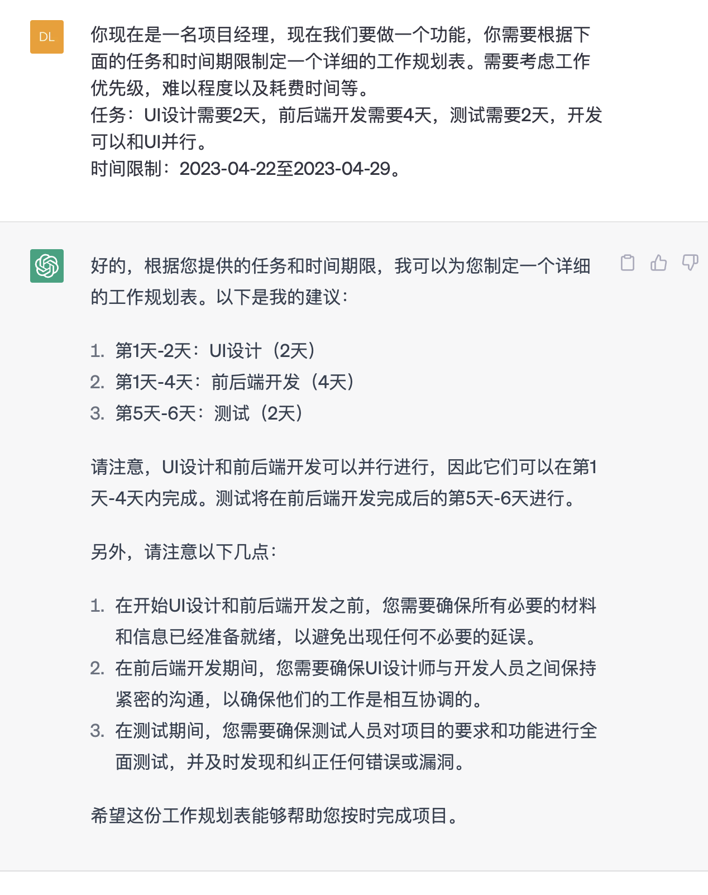
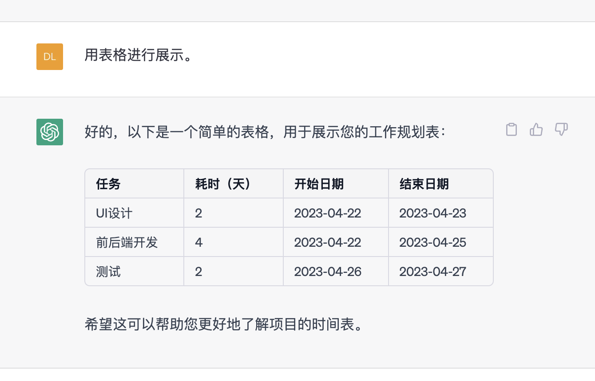
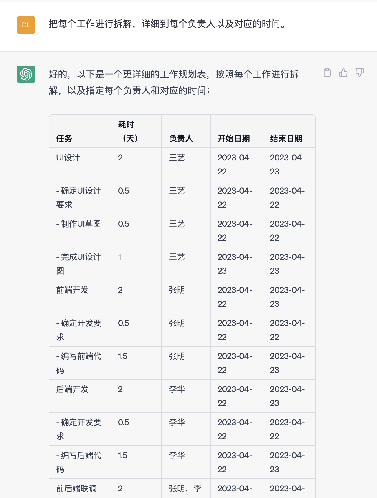
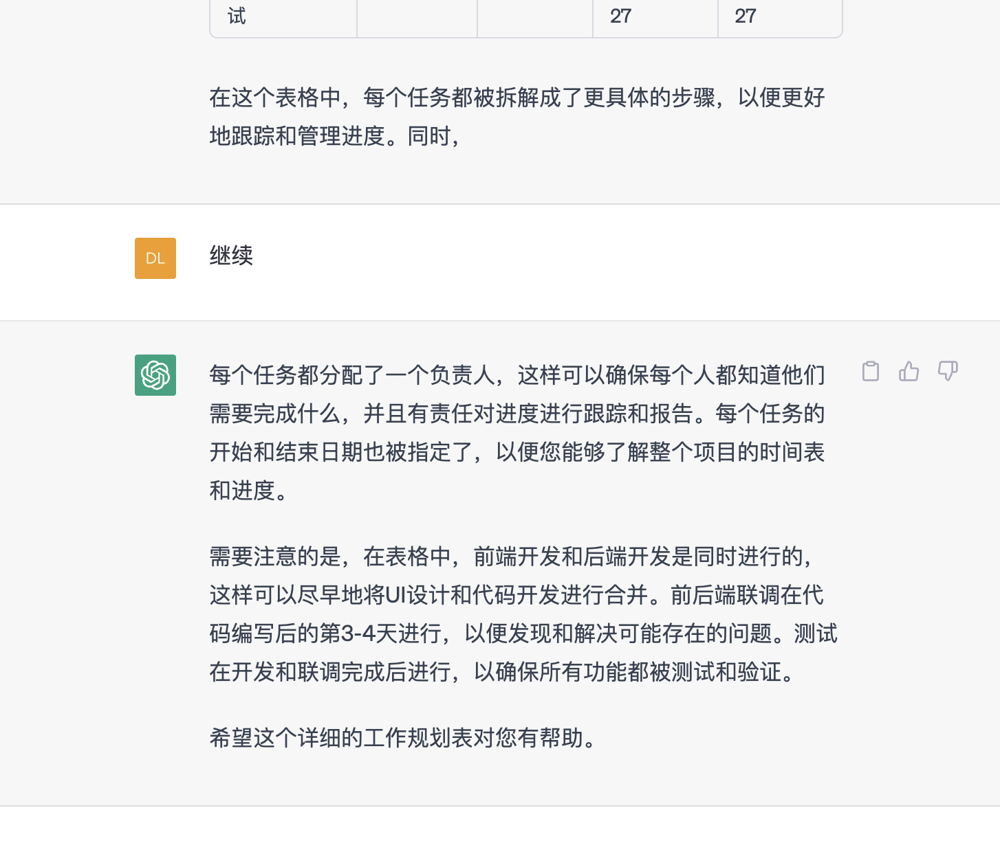

```
你现在是一名项目经理，现在我们要做一个功能，你需要根据下面的任务和时间期限制定一个详细的工作规划表。需要考虑工作优先级，难以程度以及耗费时间等。
任务：UI设计需要2天，前后端开发需要4天，测试需要2天，开发可以和UI并行。
时间限制：2023-04-22至2023-04-29。
```



```
用表格进行展示。
```



```
把每个工作进行拆解，详细到每个负责人以及对应的时间。
```



```
继续。
```

