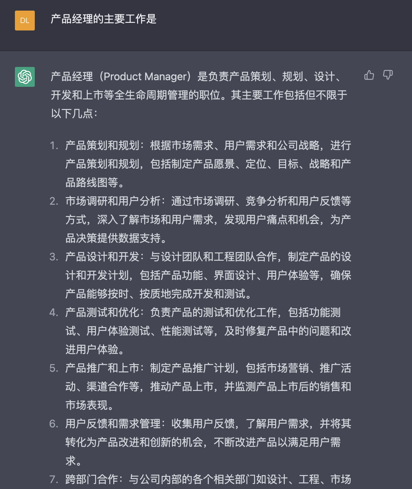
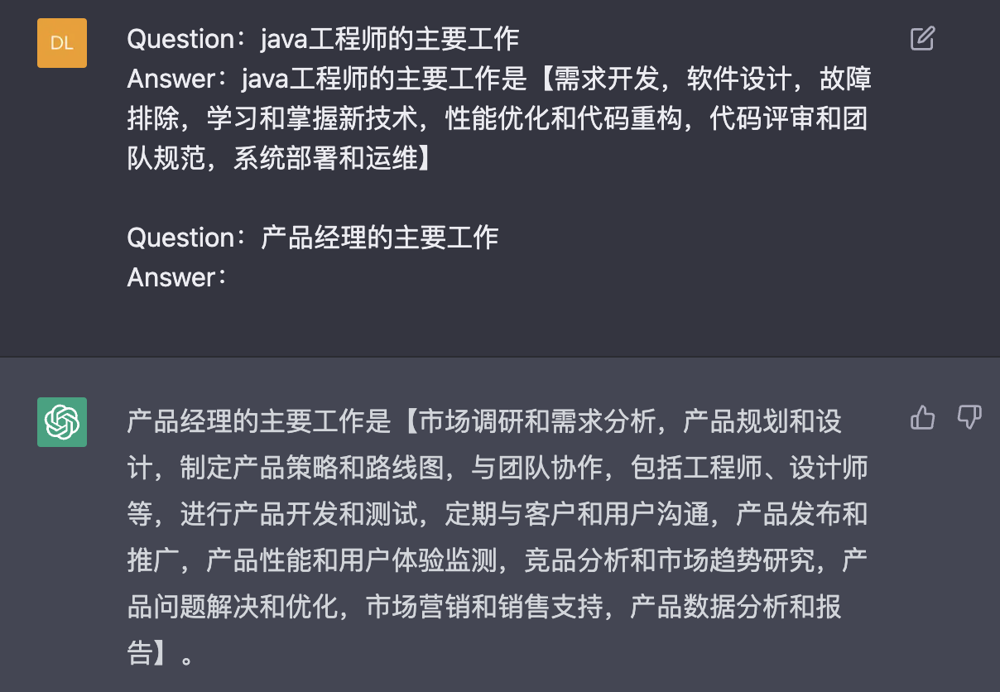
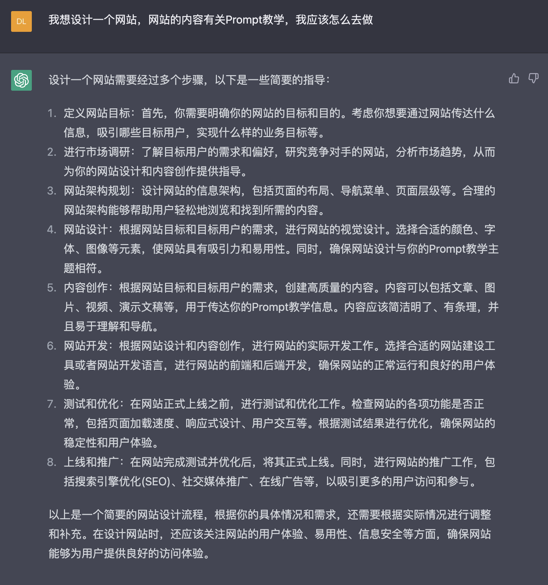
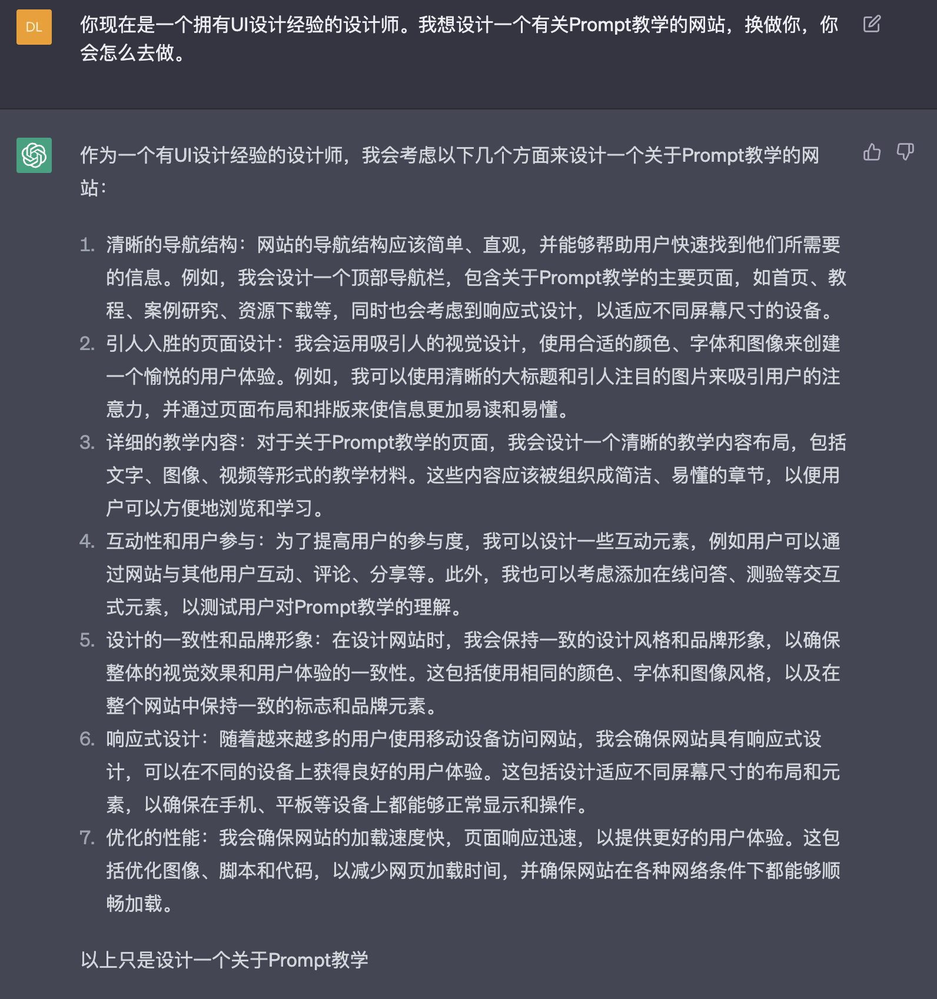
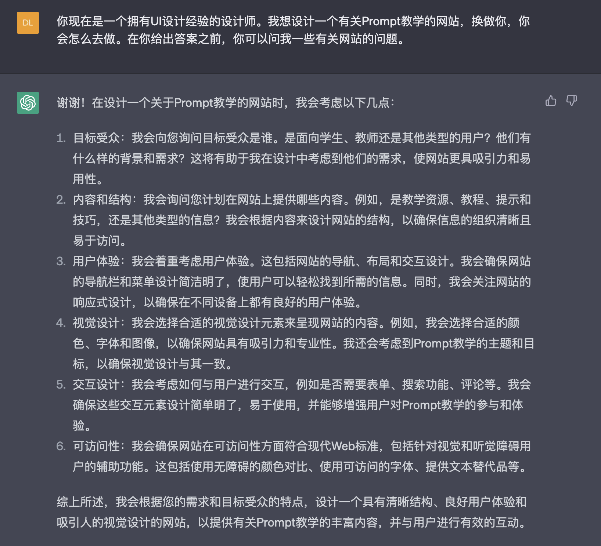
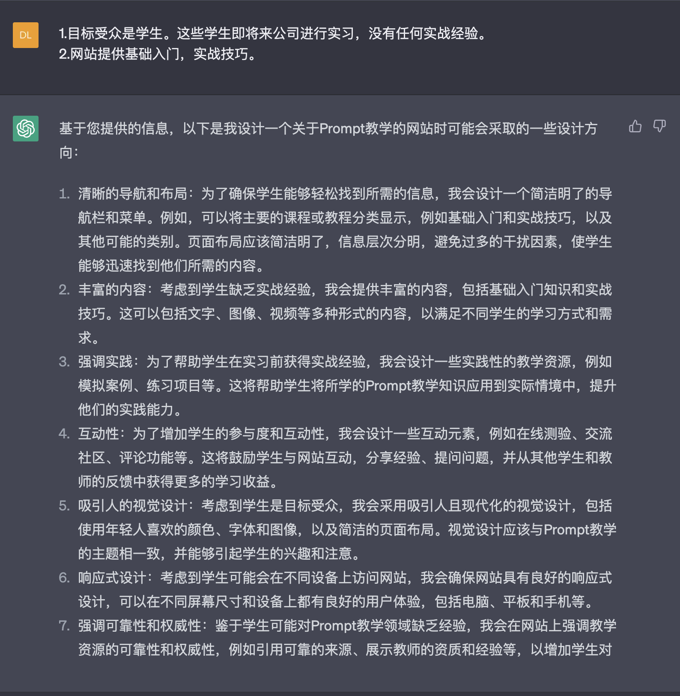

# 一.什么是Prompt

什么是NLP？

```
全称Natural Language Processing，中文名称叫自然语言处理。
简单讲就是让计算机能够理解人类语言。
```

什么是GPT？

```
中文名称叫生成式训练变压器，属于NLP。

GPT存在多个版本，GPT-1,GPT-2,GPT-3，都是历史版本。
GPT 3.5系列
官网对3.5的解释：“A set of models that improve on GPT-3 and can understand as well as generate natural language or code”
翻译成中文就是：“一组在GPT-3上改进的模型，可以理解并生成自然语言或代码” //可以理解为能够对话的GPT版本
3.5版本中的GPT-3.5-Turbo是为ChatGPT提供支持的模型，并针对对话格式进行了优化。

GPT 4，最新Model。
```

什么是Prompt?

```
与AI进行对话的脚本，能够让AI不说一些“片汤话”，使AI的回答的可以更有价值。
```

## 二.为什么要学习Prompt

1.价值

2.按照我们的想法去完成我们的工作

## 三.Prompt怎么学习

## 

```
希望AI帮我完成一个什么工作，但是跟它说完之后呢，它给你的回复就不是一个你想要的形式
或者说你给他一个任务，他给你的回复，就是一些片汤话，就不是你想要的一个东西
```

Awesome ChatGPT Prompts

prompts.chat

按照一个对应身份来进行回答

Translator //帮你润色英文和翻译英文  

在prompts上进行修改可以得到更学术的东西


怎么生成prompt -> HuggingFace

MidJourney Prompt Helper


stable diffusion

# 四.案例

## 模版

```
直接询问：根据问题回答AI它自己认为的答案。
示例询问：让AI按照示例去回答。

Me：
中国的首都是。
AI：
中国的首都是北京。

Me:
Question：中国的首都是。
Answer：中国的首都是【北京】
Question：英国的首都是
Answer：
AI：英国的首都是【伦敦】。
```

**直接询问：**



**示例询问：**



---

## 角色引入与反向提问

**我想设计一个网站，网站的内容有关Prompt教学，我应该怎么去做。**



```
我们在和AI进行沟通的时候，我们自己心里也不清楚，到底需要什么内容，直接询问，AI大概率给出一个“官方”答案。
```

**改进1（角色带入）：**

**你现在是一个拥有UI设计经验的设计师。我想设计一个有关Prompt教学的网站，换做你，你会怎么去做。**



```
赋予一个角色，比如从“你是设计师”，“你是软件工程师”等等，要求AI站在对应角色上去回答。
```

**改进2（角色带入，反向提问）：**

**你现在是一个拥有UI设计经验的设计师。我想设计一个有关Prompt教学的网站，换做你，你会怎么去做。在你给出答案之前，你可以问我一些有关网站的问题。**



**1.目标受众是学生。这些学生即将来公司进行实习，没有任何实战经验。**

**2.网站提供基础入门，实战技巧。**



```
有时候我们在做事情的时候，自己也没有头绪，可能会需要有这么一个“人”去给我们灵感，通过反问的方式，引导我们去思考。
```

---

## 重置对话

```
如果我们已经赋予AI角色后，再去问它其他问题，AI会把角色进行叠加，问题的答案就有可能出现错乱。

“忘记之前所有的角色。你现在是一名。。。”
```

---

## 继续

```
当AI没有输出完整内容的时候，可以输入“继续”，让其继续输出。
```

---

## Excel表格

