# 导读

```
众所周知OpenAI的ChatGPT目前还不知道2021年9月之后发生的事情、而且也没有能力总结大文档、基于视频进行问答等等。
所以如果想让它与时俱进，让它为我们做更多的事情，就需要第三方插件与其配合：LangChain。
```

GPT-3.5

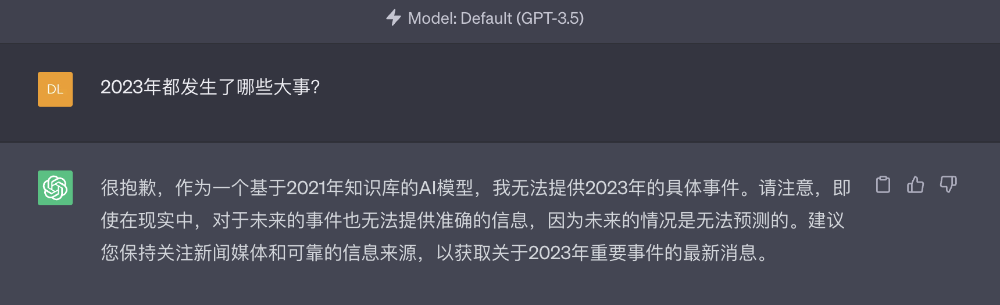

GPT-4

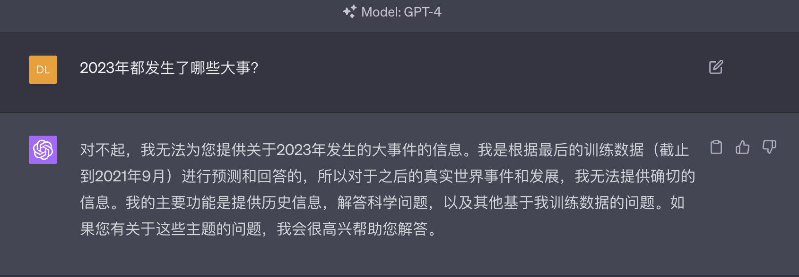


LangChain 是一个用于开发由语言模型驱动的应用程序的框架。他主要拥有 2 个能力：

1. 可以将 LLM 模型与外部数据源进行连接
2. 允许与 LLM 模型进行交互

这个库非常活跃，基本上每天都会放出来一个Release，当前有44.7的Star。最近比较火爆的AutoGPT等都是使用了LangChain框架进行开发。

LangChain等AI的开源项目Star增长曲线（绿色的线是Spring）

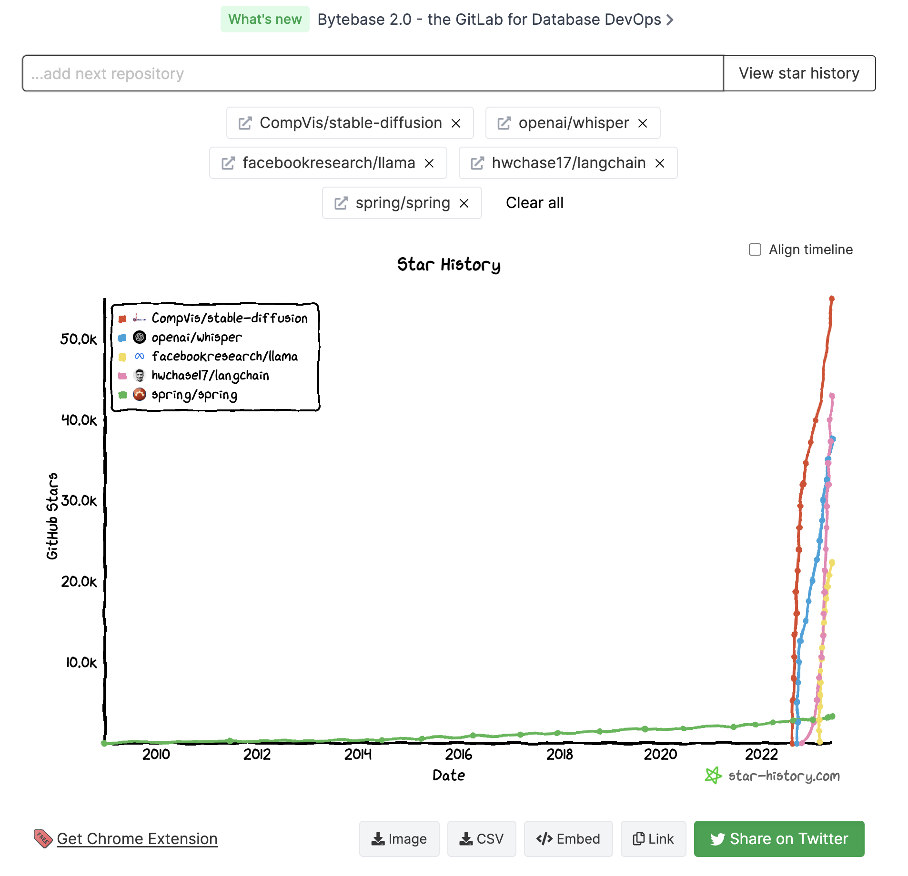

[官网地址](https://python.langchain.com/en/latest/)

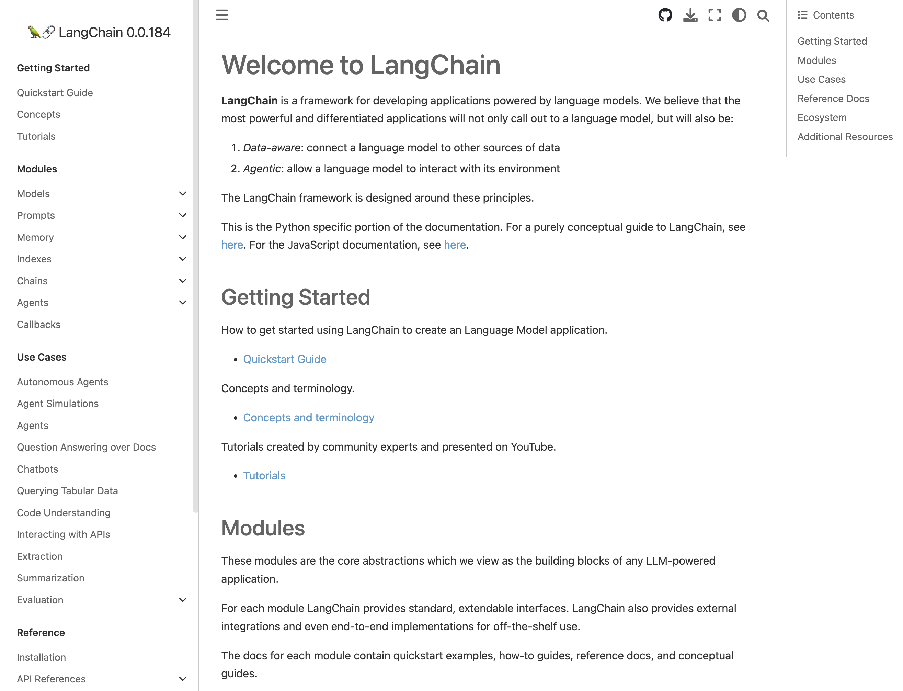

# 目标

```
1.对LangChain有个基本认识，知道什么是...
	什么是Chain
	什么是Agent
	什么是Tool
	什么是Embedding
	什么是向量数据库

2.如何利用LangChain构建一个私有化的知识库
```

# 实战

### 前提

1. 安装Python3（我的环境是3.10）
2. 准备一个OpenAI API key（中国信用卡不能申请）
3. 使用的LangChain版本0.0.184
4. 使用OpenAI版本0.27.7
5. 注册一个SerpApi账号（免费的）

### 环境准备

安装LangChain、OpenAI

```shell
pip3 install langchain
pip3 install openai
pip3 install tiktoken
```

配置OpenAI API key

```shell
export OPENAI_API_KEY="XXX"
```

```python
import os
os.environ["OPENAI_API_KEY"] = "XXX"
```

## 1.完成一次问答

使用LangChain加载OpenAI，完成一次问答

```python
from langchain.llms import OpenAI

llm = OpenAI(temperature=0.9)
print(llm("一家注重用户体验的物流公司取什么名字好？"))

###
悦货快递、体验速运、惠悦速运、乐享速运、顺畅物流、丝滑快运、快愉物流、心悦物流、用心物流、体验派送、完美物流、精致快运、丰收快运、赏心物流、流派物流、焕享物流、思悦物流等。
###
```

## 2.提示模版（什么是Chain）

先安装Google环境

```
pip3 install google-search-results
```

代码

```python
from langchain.prompts import PromptTemplate
from langchain.llms import OpenAI
from langchain.chains import LLMChain

llm = OpenAI(temperature=0.9)
prompt = PromptTemplate(
    input_variables=["product"],
    template="一家生产{product}的公司取什么名字好？",
)
chain = LLMChain(llm=llm, prompt=prompt)
print(chain.run("冰箱"))

###
可以取名为IceWorks（冰工厂）、ColdLife（冷生活）、FreezeClan（冷冻部落）、CoolKing（冷王）、FrostRoom（霜室）以及ArcticDream（北极梦）等。
###
```

按照上面的执行流程就是可以分两步，可以理解为链条上的两个任务

第一个任务是接收用户输入，使用PromptTemplate对其进行格式化

第二个任务是将格式化的响应在传递给LLM

## 3.利用Google实现AI问答（什么是Agent，Tool）

首先导入SerpApi Key

```python
import os
os.environ["SERPAPI_API_KEY"] = "XXX"
```

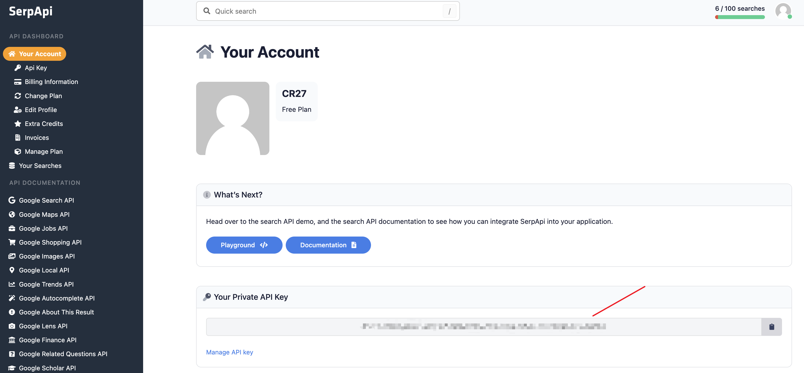

```python
from langchain.agents import load_tools
from langchain.agents import initialize_agent
from langchain.agents import AgentType
from langchain.llms import OpenAI

# 加载OpenAI模型
llm = OpenAI(temperature=0)
# 加载可能需要用到的Tool
tools = load_tools(["serpapi", "llm-math"], llm=llm)
# verbose=True表示输出执行过程
agent = initialize_agent(tools, llm, agent=AgentType.ZERO_SHOT_REACT_DESCRIPTION, verbose=True)
print(agent.run("What was the high temperature in SF yesterday in Fahrenheit? What is that number raised to the .023 power?"))
```

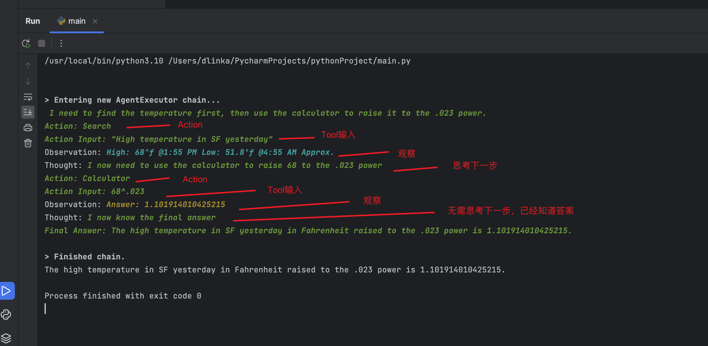

可以看到上面的返回结果，LangChain利用LLM将问题拆成了几个步骤，然后一步步得到最终的答案

查看2023年发生了什么大事

```python
###
> Entering new AgentExecutor chain...
 I need to find out what happened in 2023 #对中文不友好
Action: Search
Action Input: 2023 major events
Observation: 10 Major Events To Look Forward To In 2023
Thought: I should read the article to find out what happened
Action: Read
Action Input: 10 Major Events To Look Forward To In 2023
Observation: Read is not a valid tool, try another one.
Thought: I should read the article to find out what happened
Action: Search
Action Input: 10 Major Events To Look Forward To In 2023
Observation: 10 Major Events To Look Forward To In 2023
Thought: I now know the major events that happened in 2023
Final Answer: The major events that happened in 2023 include the opening of the Tokyo Olympics, the completion of the world's tallest building in Dubai, the launch of the first crewed mission to Mars, the completion of the world's longest railway tunnel in Switzerland, the opening of the world's longest sea bridge in China, the launch of the world's first 5G network, the completion of the world's largest solar power plant in India, the opening of the world's largest theme park in Japan, the completion of the world's longest high-speed railway in China, and the launch of the world's first autonomous vehicle.

> Finished chain.
The major events that happened in 2023 include the opening of the Tokyo Olympics, the completion of the world's tallest building in Dubai, the launch of the first crewed mission to Mars, the completion of the world's longest railway tunnel in Switzerland, the opening of the world's longest sea bridge in China, the launch of the world's first 5G network, the completion of the world's largest solar power plant in India, the opening of the world's largest theme park in Japan, the completion of the world's longest high-speed railway in China, and the launch of the world's first autonomous vehicle.
###
```

**Agent：使用LLM来确定采取哪些动作，动作使用Tool来实现**

**Tool：执行特定的动作功能，可以Google，数据库查找等等**

## 4.总结（Summarization）

一个AI比较常见的使用场景是总结长文档，但是目前OpenAI对token做了限制处理，GPT-3.5是**2048**个，GPT-4是**8192**个，超过最大限制就会报错

GPT-3.5

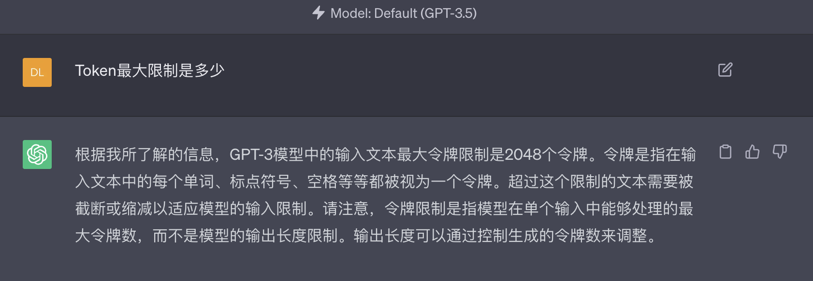

GPT-4

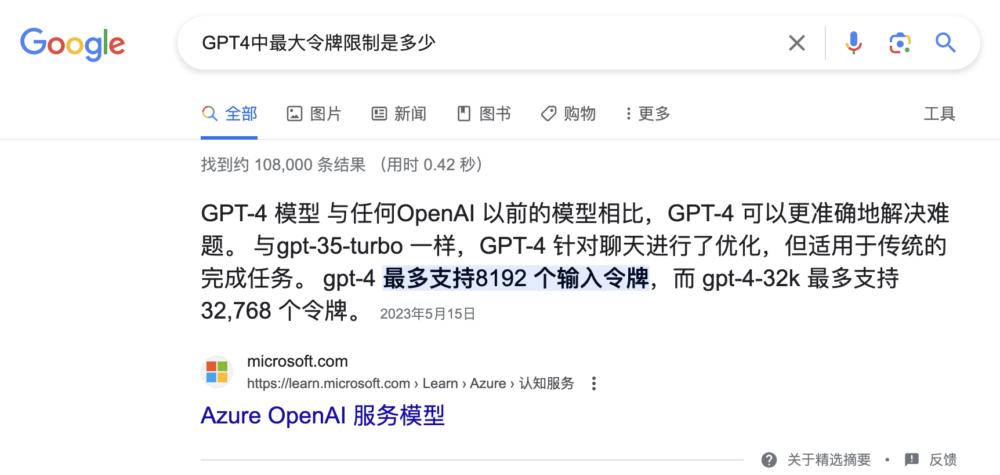

而且这类需求与普通的问答不同，没有特定的语义搜索选择与问题最相关的文本块

LangChain针对这个问题是将文档拆成多个指定大小的块，然后以多种不同方式进行多次汇总（下面会介绍有哪些方式）

准备数据：MySQL必知必会

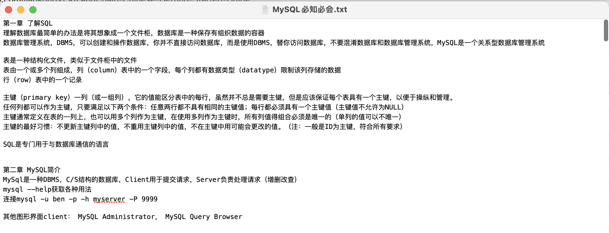

代码

```python
from langchain import OpenAI
from langchain.text_splitter import CharacterTextSplitter
from langchain.docstore.document import Document
from langchain.chains.summarize import load_summarize_chain

print("加载模型")
llm = OpenAI(temperature=0)

print("创建Text Splitters")
# 使用CharacterTextSplitter
# chunk_overlap指切割后的文本包含上一个文本结尾的内容，主要作用是为了增加每个文本的上下文关联
text_splitter = CharacterTextSplitter(chunk_size=650, chunk_overlap=0, length_function=len)

print("加载文件")
with open("./mysql.txt") as f:
    mysql = f.read()

texts = text_splitter.split_text(mysql)
print(f'拆分：{len(texts)}')

docs = [Document(page_content=t) for t in texts[:2]]
print(f'只总结前两个：{len(docs)}')

print(docs[0])
print(f'{len(docs[0].page_content)}')
print(docs[1])
print(f'{len(docs[1].page_content)}')

chain = load_summarize_chain(llm, chain_type="map_reduce", verbose=True)
print(chain.run(docs))
```

运行结果

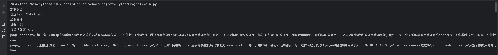

总结第一个文本Chunk

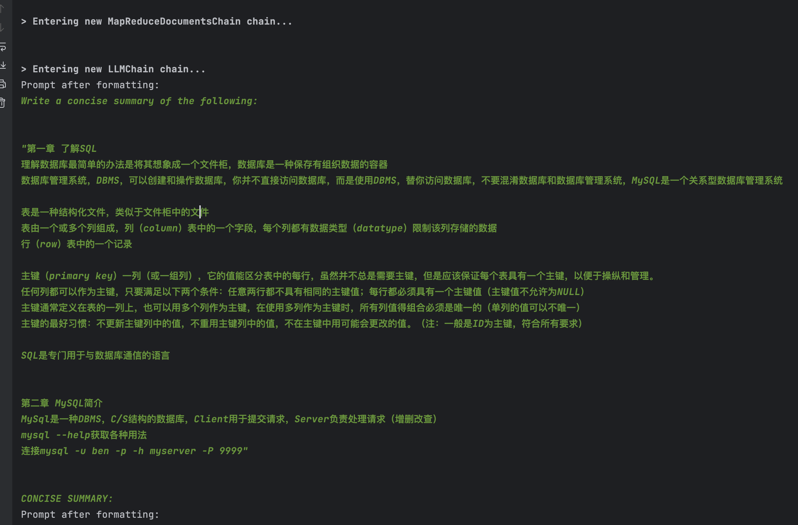

总结第二个文本Chunk

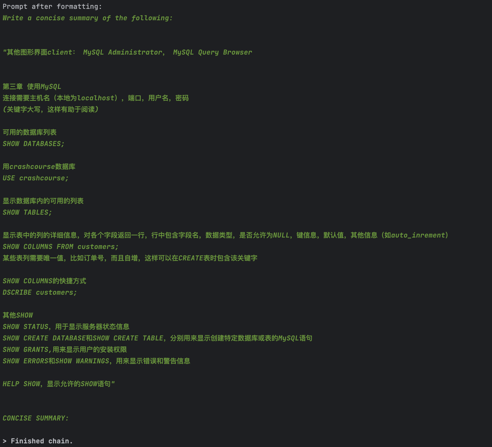

汇总总结

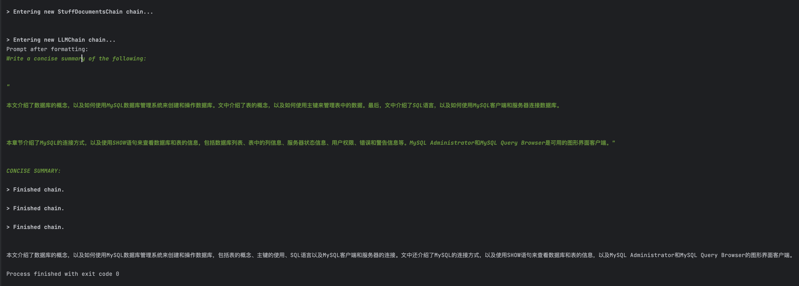

```
本文介绍了数据库的概念，以及如何使用MySQL数据库管理系统来创建和操作数据库，包括表的概念、主键的使用、SQL语言以及MySQL客户端和服务器的连接。文中还介绍了MySQL的连接方式，以及使用SHOW语句来查看数据库和表的信息，以及MySQL Administrator和MySQL Query Browser的图形界面客户端。
```

**chain_type**：

stuff：最简单的总结，一次性总结，可以忘记了，一般总结不会选用这个

map_reduce：先将每个分割后的文档进行总结，在汇总总结

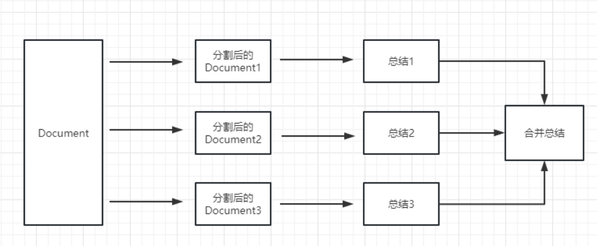

refine:先总结第一个文档，然后将第一个文档总结出来的内容和第二个文档一起再次发送给LLM进行总结，以此类推

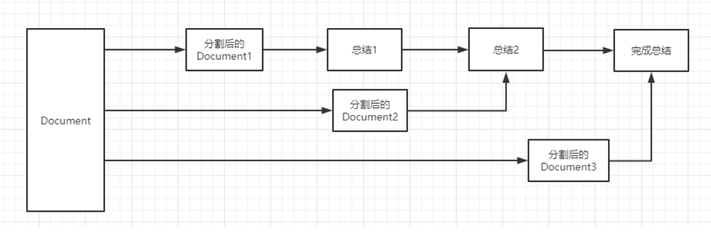

## 5.构建本地知识库

这个是个很有用的场景，比如可以很方便的做一个可以介绍公司业务的机器人，或是介绍一个产品的机器人。

**Embedding**：衡量文本字符串的相关性

LangChain支持的向量数据库

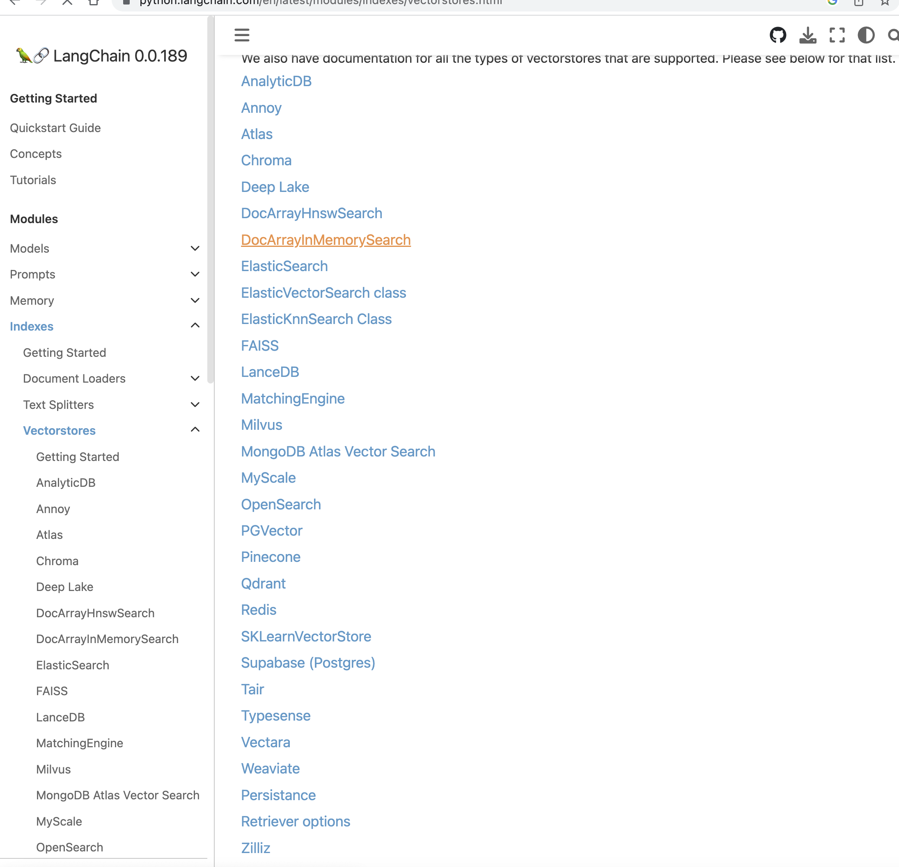

安装向量数据库：Chroma（也可以使用Redis）

```
pip3 install chromadb
```

Chroma原理

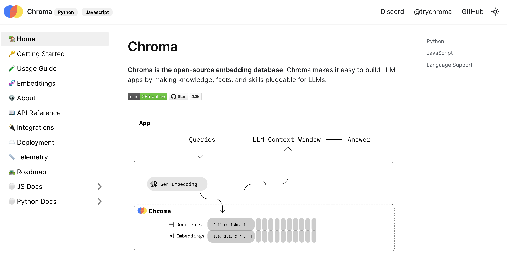

私有化数据准备

在上面的txt文件中加入一段话“MySQL市场占有率8.1231233%”

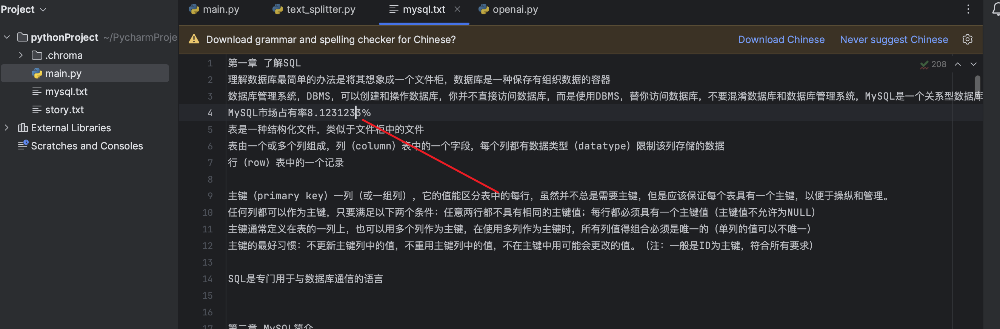

代码

```python
from langchain.embeddings.openai import OpenAIEmbeddings
from langchain.vectorstores import Chroma
from langchain.text_splitter import CharacterTextSplitter
from langchain.llms import OpenAI
from langchain.chains import RetrievalQA
from langchain.document_loaders import TextLoader


loader = TextLoader("./mysql.txt")
documents = loader.load()
text_splitter = CharacterTextSplitter(chunk_size=650, chunk_overlap=0, length_function=len)
texts = text_splitter.split_documents(documents)
print(f'拆分：{len(texts)}')

# 为了演示只取前四章
texts = texts[0:4]
print(f'只取前四章：{len(texts)}')

# 使用OpenAI的Embedding
embeddings = OpenAIEmbeddings()
# 通过OpenAI的Embedding对象计算embedding向量信息并临时存入Chroma向量数据库，用于后续匹配查询
docsearch = Chroma.from_documents(texts, embeddings)

# 创建QA
qa = RetrievalQA.from_chain_type(llm=OpenAI(), chain_type="stuff", retriever=docsearch.as_retriever())
query = "MySQL市场占有率是多少？"
print(qa.run(query))
```

结果

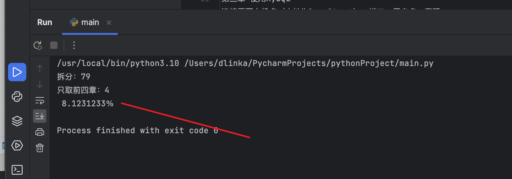

---

