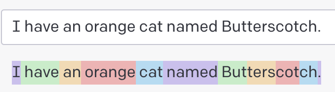

### GPT的历史

```
GPT-1，GPT-2，GPT-3

GPT 3.5系列
官网对3.5的解释
“A set of models that improve on GPT-3 and can understand as well as generate natural language or code”
翻译成中文就是
“一组在GPT-3上改进的模型，可以理解并生成自然语言或代码” //可以理解为能够对话的GPT版本
3.5版本中的GPT-3.5-Turbo是为ChatGPT提供支持的模型，并针对对话格式进行了优化。

GPT 4
```

[GPT家族进化史](https://36kr.com/p/2175356267112706)

[Models](https://platform.openai.com/docs/models)

---

### ChatGPT为什么不按照秒，月，句子收费？

```
如果按秒，AI的响应故意“加1秒”，谁也不知道。
如果按月，那就存在有人“一直”问问题，对AI来讲服务越优质，成本越高，利润越少，不公平。
如果按句子，句子有简单句和复杂句之分，回答复杂句的成本可能都可以回复好几个简单句了。

ChatGPT收费单位是token，1000个token收费0.002美元。token可以理解为文本分词。
可以通过这个https://platform.openai.com/tokenizer网站，计算token数量。
```

---

### Completions是什么意思？

```
中文翻译为补全更容易理解
```

---

### 提示模版

```
Suggest three names for an animal that is a superhero.

Animal: Cat
Names: Captain Sharpclaw, Agent Fluffball, The Incredible Feline
Animal: Dog
Names: Ruff the Protector, Wonder Canine, Sir Barks-a-Lot
Animal: Horse
Names:
```

---

### temperature

```
Remember that the model predicts which text is most likely to follow the text preceding it. Temperature is a value between 0 and 1 that essentially lets you control how confident the model should be when making these predictions. Lowering temperature means it will take fewer risks, and completions will be more accurate and deterministic. Increasing temperature will result in more diverse completions.
↓
↓
请记住，该模型预测哪个文本最有可能跟在它前面的文本之后。温度是一个介于0和1之间的值，基本上可以让您控制模型在进行这些预测时的置信度。降低温度意味着它将承担更少的风险，并且完成将更加准确和确定。升高温度将导致更多样化的完成。
```

### token

```
Our models process text by breaking it down into smaller units called tokens. Tokens can be words, chunks of words, or single characters. 
↓
↓
我们的模型通过将文本分解为更小的单元（称为标记）来处理文本。标记可以是单词、单词块或单个字符。

As a rough rule of thumb, 1 token is approximately 4 characters or 0.75 words for English text.
↓
↓
根据粗略的经验法则，对于英文文本，1个token大约为4个字符或0.75个单词。
```

常用词会被标记为一个token，但是不太常用的词会被拆分成多个token。例如，“Butterscotch”翻译成四个token：“But”、“ters”、“cot”和“ch”。



