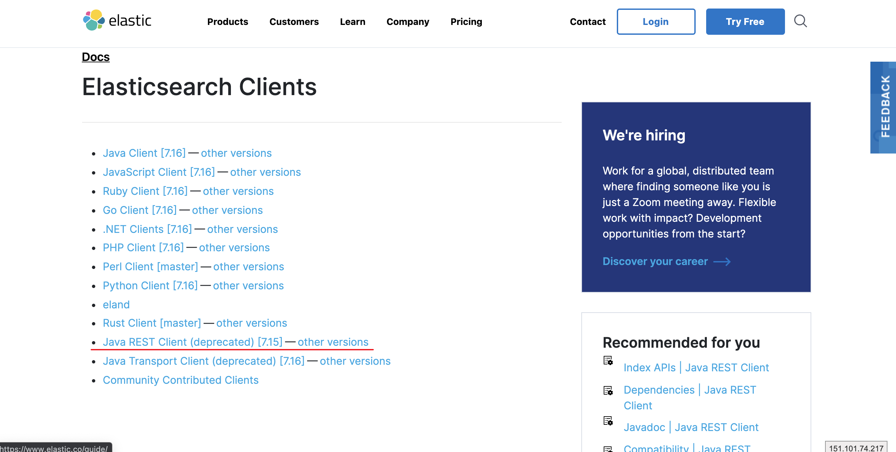

```
7.6.1

文档不依赖预先定义的模式

Elasticsearch会自动的将新加的字段加入映射,但是这个字段的类型是不确定的,Elasticsearch就只能猜,如果这个值是18,那么会认为是整型,但是也可能猜不对.所以最安全的方式就是提前定义好所需要的映射,这点跟关系型数据库殊途同归了,先定义好字段,然后在使用.
```

---

#### Document(https://www.elastic.co/guide/index.html)

**Elasticsearch Clients > Java REST Client > Java Higth Level REST Client**



