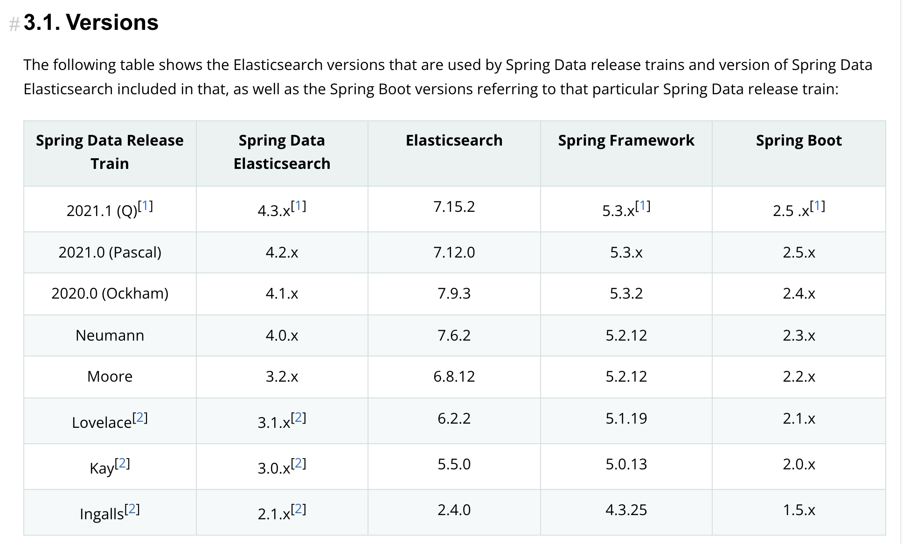
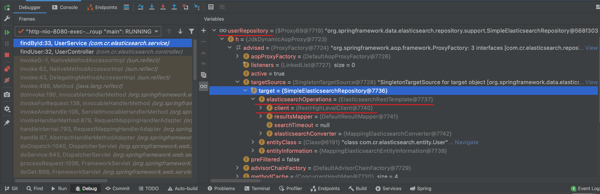

### 版本

https://docs.spring.io/spring-data/elasticsearch/docs/current/reference/html/#preface.requirements



---

```java
Spring Boot:2.2.5.RELEASE
Elasticsearch:7.6.1(pom中修改elasticsearch.version为7.6.1)
```

### 源码解析

spring-boot-autoconfigure.jar/spring.factories

```java
org.springframework.boot.autoconfigure.data.elasticsearch.ElasticsearchAutoConfiguration,\
org.springframework.boot.autoconfigure.data.elasticsearch.ElasticsearchDataAutoConfiguration,\
org.springframework.boot.autoconfigure.data.elasticsearch.ElasticsearchRepositoriesAutoConfiguration,\
org.springframework.boot.autoconfigure.data.elasticsearch.ReactiveElasticsearchRepositoriesAutoConfiguration,\
org.springframework.boot.autoconfigure.data.elasticsearch.ReactiveRestClientAutoConfiguration,\
  
org.springframework.boot.autoconfigure.elasticsearch.jest.JestAutoConfiguration,\
org.springframework.boot.autoconfigure.elasticsearch.rest.RestClientAutoConfiguration,\
```

#### 1.ElasticsearchDataAutoConfiguration

```java
@ConditionalOnClass({ ElasticsearchTemplate.class })
@AutoConfigureAfter({ 
  RestClientAutoConfiguration.class //2
})
@Import({ 
  ElasticsearchDataConfiguration.BaseConfiguration.class,
  ElasticsearchDataConfiguration.RestClientConfiguration.class //3
})
public class ElasticsearchDataAutoConfiguration {
}
```

#### 2.RestClientAutoConfiguration

```java
@ConditionalOnClass(RestClient.class)
@EnableConfigurationProperties(RestClientProperties.class) //配置类
@Import({ 
  RestClientConfigurations.RestClientBuilderConfiguration.class,
  RestClientConfigurations.RestHighLevelClientConfiguration.class })
public class RestClientAutoConfiguration {
}
↓
↓
class RestClientConfigurations {
  //注入RestClientBuilder
  @Configuration(proxyBeanMethods = false)
	static class RestClientBuilderConfiguration {
		@Bean
		@ConditionalOnMissingBean
		RestClientBuilder elasticsearchRestClientBuilder(
      RestClientProperties properties,
      ObjectProvider<RestClientBuilderCustomizer> builderCustomizers) {
			...
			return builder;
		}
	}
  
  //注入RestHighLevelClient
  @Configuration(proxyBeanMethods = false)
	@ConditionalOnClass(RestHighLevelClient.class)
	static class RestHighLevelClientConfiguration {
		@Bean
		@ConditionalOnMissingBean
		RestHighLevelClient elasticsearchRestHighLevelClient(RestClientBuilder restClientBuilder) {
			return new RestHighLevelClient(restClientBuilder);
		}
  }
}
```

#### 3.RestClientConfiguration

```java
abstract class ElasticsearchDataConfiguration {
	//注入ElasticsearchRestTemplate
  @Configuration(proxyBeanMethods = false)
	@ConditionalOnClass(RestHighLevelClient.class)
	static class RestClientConfiguration {	
		@Bean
		@ConditionalOnMissingBean(value = ElasticsearchOperations.class, name = "elasticsearchTemplate")
		@ConditionalOnBean(RestHighLevelClient.class)
		ElasticsearchRestTemplate elasticsearchTemplate(RestHighLevelClient client,
                                                    ElasticsearchConverter converter,
                                                    ResultsMapper resultsMapper) {
			return new ElasticsearchRestTemplate(client, converter, resultsMapper);
		}
	}
}
```

---

#### 三种方式

```
前两种方式底层都是使用RestHighLevelClient
ElasticsearchRepository依赖ElasticsearchRestTemplate,ElasticsearchRestTemplate依赖RestHighLevelClient
```

#### 第一种:继承ElasticsearchRepository接口



#### 1.AbstractElasticsearchRepository#findById

```java
public Optional<T> findById(ID id) {
  GetQuery query = new GetQuery();
  query.setId(stringIdRepresentation(id));
  return Optional.ofNullable(elasticsearchOperations.queryForObject(query, getEntityClass()));
}
```

#### 2.ElasticsearchRestTemplate#queryForObject

```java
public <T> T queryForObject(GetQuery query, Class<T> clazz) {
  return queryForObject(query, clazz, resultsMapper);
}
↓
↓
public <T> T queryForObject(GetQuery query, Class<T> clazz, GetResultMapper mapper) {
  ElasticsearchPersistentEntity<T> persistentEntity = getPersistentEntityFor(clazz);
  GetRequest request = new GetRequest(persistentEntity.getIndexName(),
                                      persistentEntity.getIndexType(),
                                      query.getId());
  GetResponse response;
  try {
    response = client.get(request, RequestOptions.DEFAULT);
    return mapper.mapResult(response, clazz);
  }
}
```

#### 第二种:使用ElasticsearchRestTemplate

#### 第三种:使用原生RestHighLevelClient