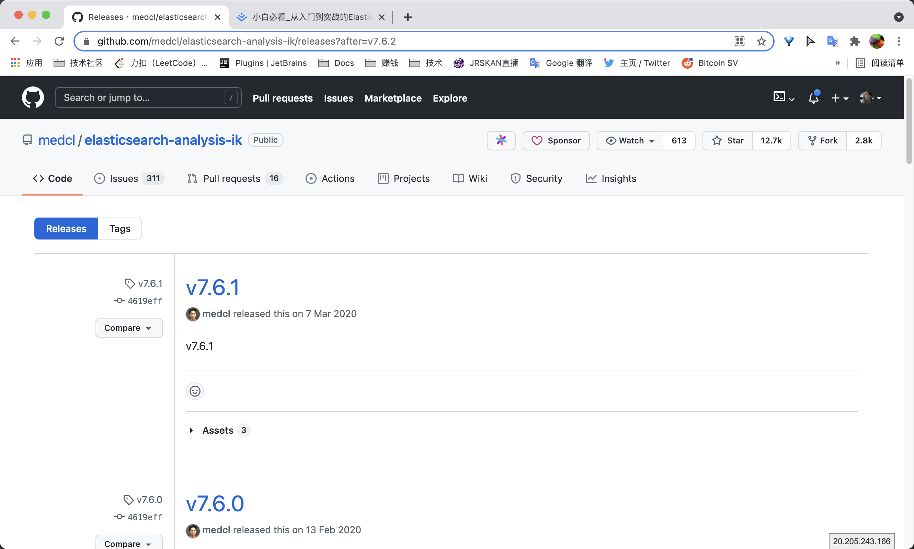
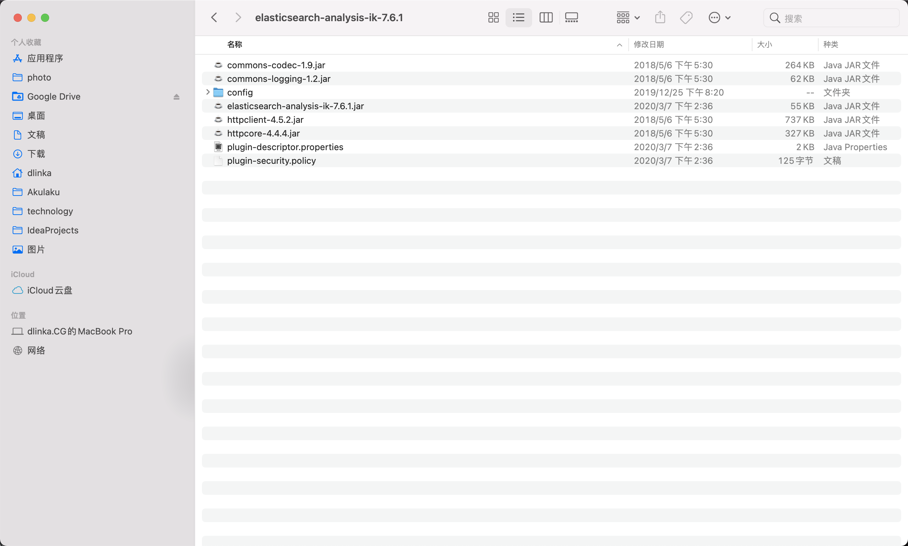

### ik分词器

#### 1.下载地址:https://github.com/medcl/elasticsearch-analysis-ik/releases

需要与Elasticsearch版本一致



#### 2.解压到Elasticsearch的plugins目录



#### 3.重启Elasticsearch


#### 4.Kibana中调试

##### ik_max_word

```
GET _analyze
{
  "analyzer": "ik_max_word",
  "text": "中华人民共和国人民大会堂"
}
```


##### ik_smart

```
GET _analyze
{
  "analyzer": "ik_smart",
  "text": "中华人民共和国人民大会堂"
}
```


#### 5.自定义词典

##### 创建自定义词典:plugins/elasticsearch-analysis-ik-7.6.1/config/user.dic

```
迪迦在东北
```

##### 修改IKAnalyzer.cfg.xml

```xml
<entry key="ext_dict">user.dic</entry>
```


---

#### 查看插件

```
./elasticsearch-plugin list
```

