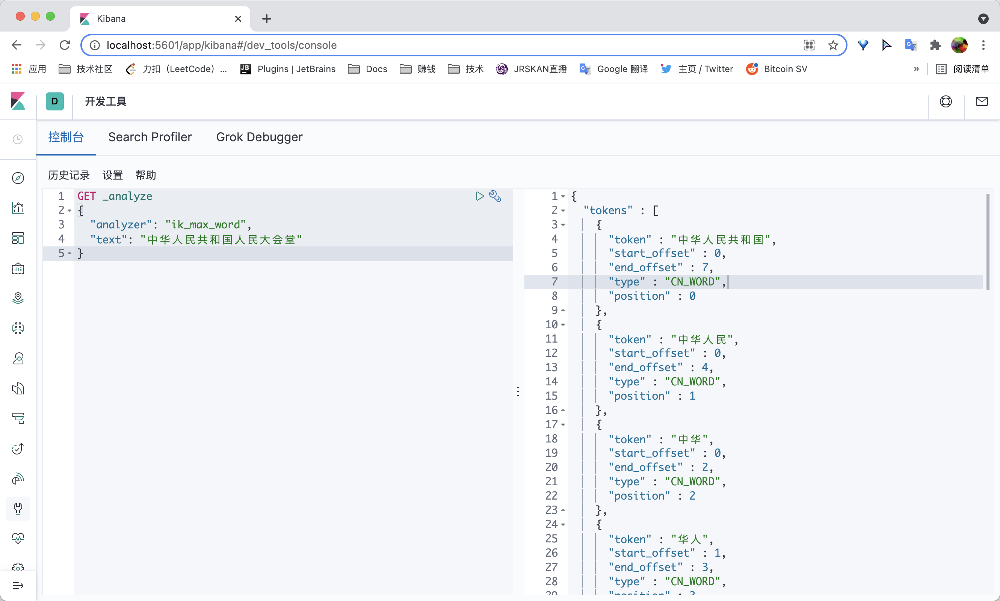
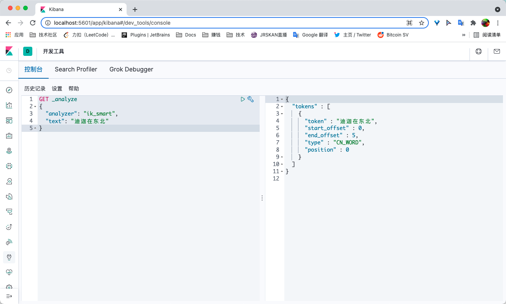

#### 1.下载地址:https://github.com/medcl/elasticsearch-analysis-ik/releases

需要与Elasticsearch版本一致

#### 2.解压到elasticsearch的plugins目录

#### 3.重启Elasticsearch


#### 4.查看插件

```
./elasticsearch-plugin list
```

#### 5.测试

##### ik_max_word(细粒度)

```
GET _analyze
{
  "analyzer": "ik_max_word",
  "text": "中华人民共和国人民大会堂"
}
```



##### ik_smart(粗粒度)

```
GET _analyze
{
  "analyzer": "ik_smart",
  "text": "中华人民共和国人民大会堂"
}
```


#### 6.自定义词典

##### 创建自己的词典:plugins/elasticsearch-analysis-ik-7.6.1/config/custom.dic

```

```

##### 配置自己的扩展字典:IKAnalyzer.cfg.xml

```xml
<entry key="ext_dict">custom.dic</entry>
```

##### 测试

---

