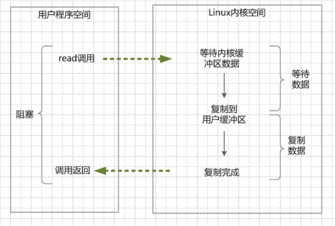
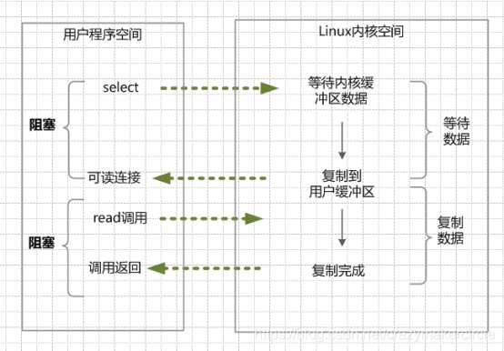

#### 概念

##### 同步阻塞IO

```
1.当用户线程调用了read系统调用，内核就开始了IO的第一个阶段：准备数据
	很多时候，数据在一开始还没有到达，比如还没有收到一个完整的Socket数据包，这个时候内核就要等待足够的数据到来

2.当内核一直等到数据准备好了，它就会将数据从内核缓冲区拷贝到用户缓冲区，然后内核返回结果

3.从开始IO#read系统调用开始，用户线程就进入阻塞状态
	一直到内核返回结果后，用户线程才解除阻塞的状态，重新运行起来
```




##### 同步非阻塞IO

```
1.在内核数据没有准备好的阶段，用户线程发起IO请求时，立即返回
	用户线程需要不断地发起IO系统调用。

2.内核数据到达后，用户线程发起系统调用，用户线程阻塞
	内核开始复制数据，它就会将数据从内核缓冲区拷贝到用户缓冲区，然后内核返回结果

3.用户线程才解除阻塞的状态，重新运行起来
	经过多次的尝试，用户线程终于真正读取到数据，继续执行
```


##### IO多路复用模型

```
1.进行select系统调用，内核会查询所有socket列表，当任何一个socket中的数据准备好了，select就会返回
	当用户进程调用了select，那么用户进程会被阻塞

2.用户线程获得了可读socket后，发起read系统调用，用户线程阻塞
	内核开始复制数据，它就会将数据从内核缓冲区拷贝到用户缓冲区，然后内核返回结果
	
3.用户线程解除阻塞的状态，用户线程终于真正读取到数据，继续执行
```




Buffer

Channel：双向

```
ServerSocketChannel-ServerSocketChannelImpl
SocketChannel-SocketChannelImpl
FileChannel-FileChannelImpl
```

https://segmentfault.com/a/1190000040230583
