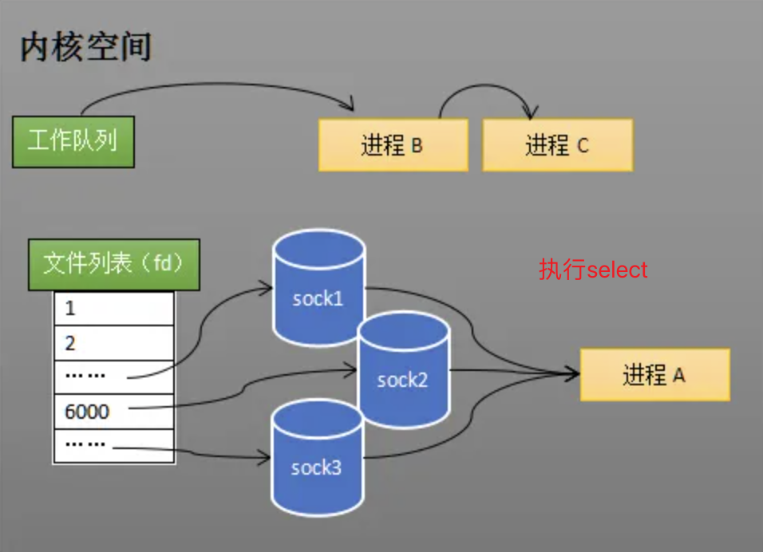
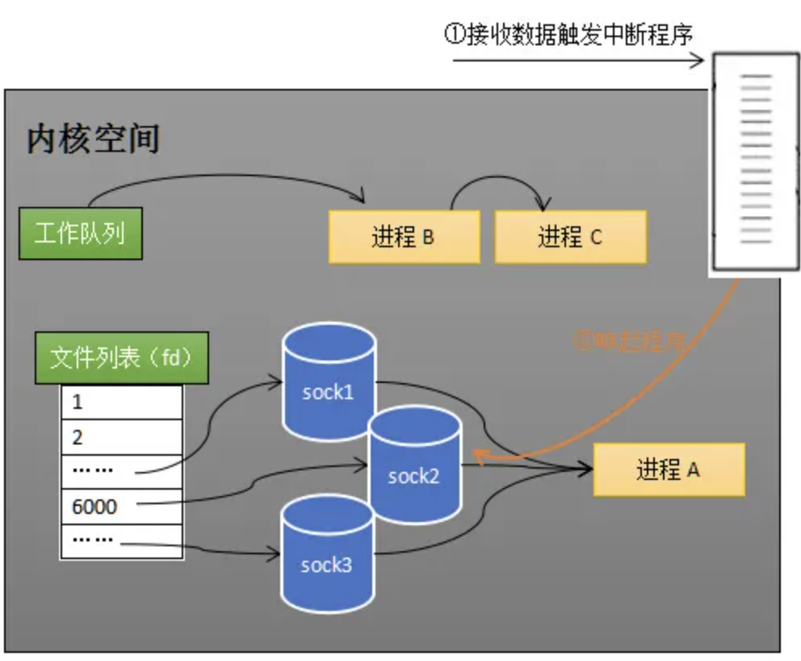
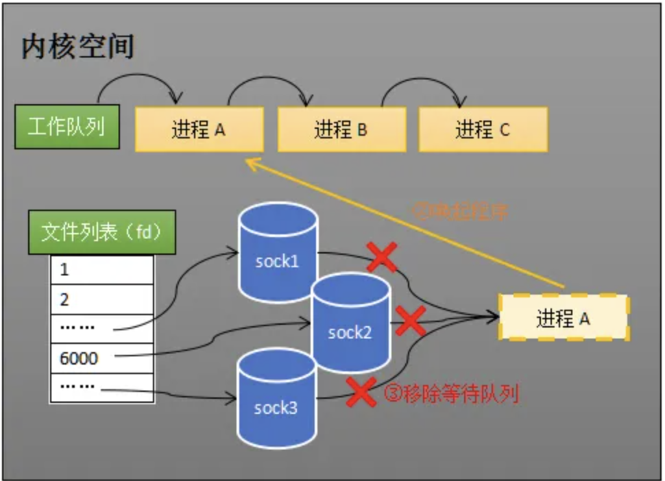
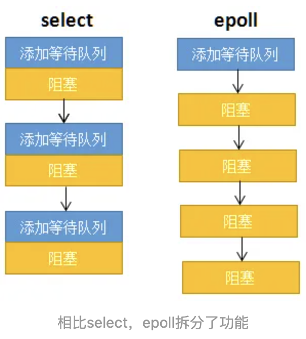
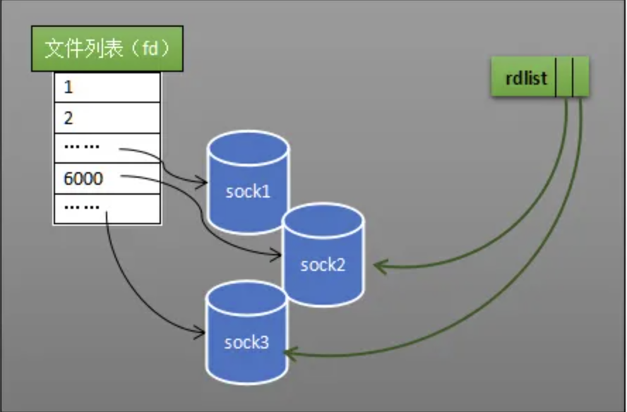
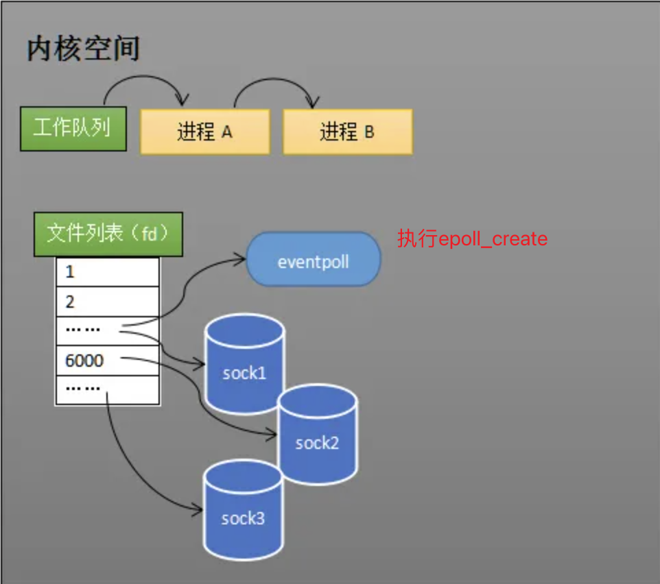
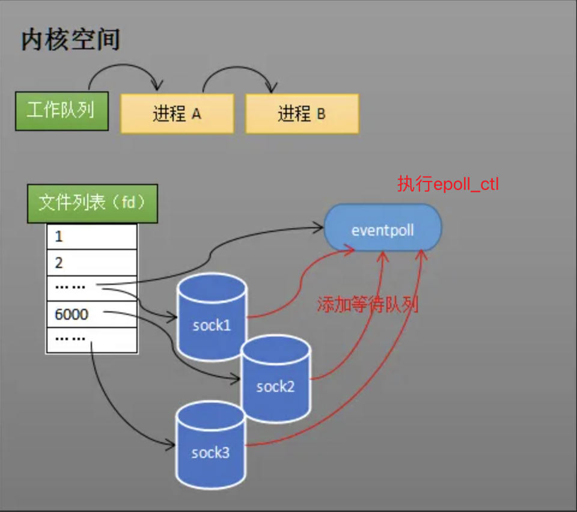
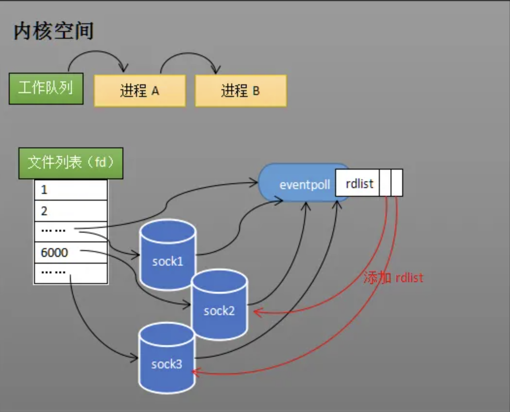
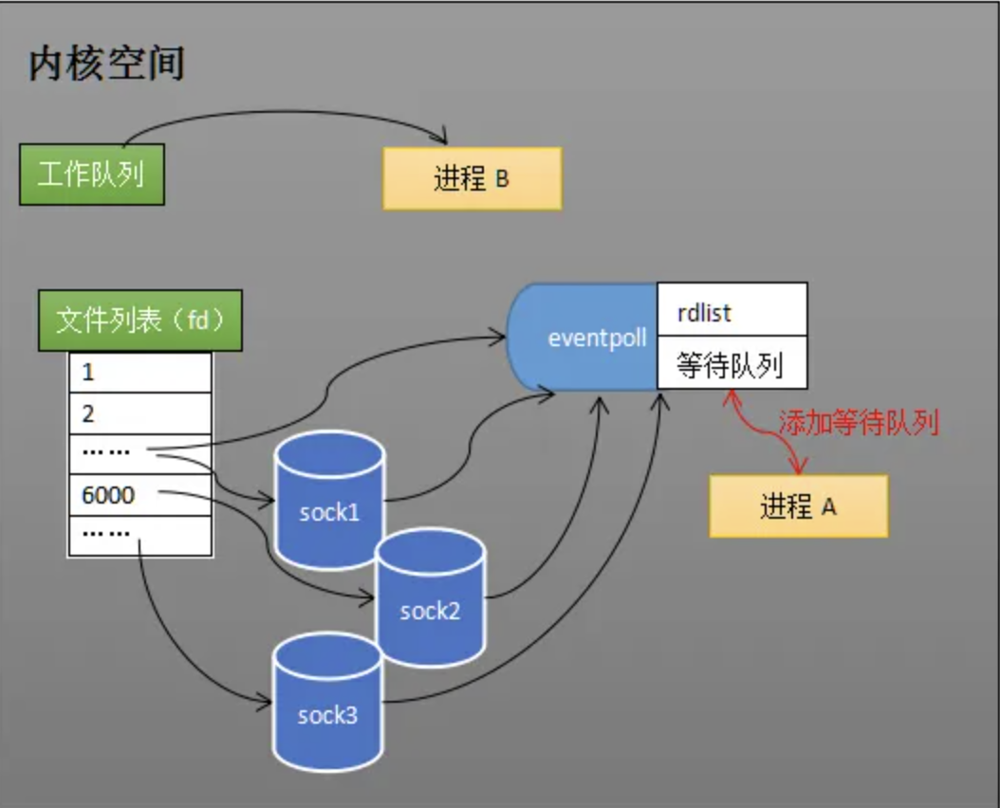
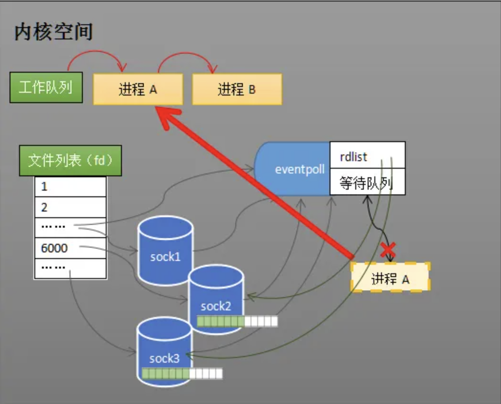

## select

服务端需要监视多个客户端连接，而rece只能监视单个socket，这种矛盾下，人们开始寻找监视多个socket的方法

从历史发展角度看，必然先出现一种不太高效的方法，人们再加以改进

**select伪代码**

```C
int s = socket(AF_INET, SOCK_STREAM, 0);  
bind(s, ...);
listen(s, ...);

int fds[] = 存放需要监听的socket;

while(1) {
  int n = select(..., fds, ...);
  for(int i=0; i < fds.count; i++) {
    if(FD_ISSET(fds[i], ...)) {
      //fds[i]的数据处理
    }
  }
}
```

调用select之后，进程A会分别加入这三个socket的等待队列中，阻塞进程



当任何一个socket收到数据后，中断程序将唤起进程，所谓唤起进程，就是将进程从所有的等待队列中移除，加入到工作队列里面

当进程A被唤醒后，它知道至少有一个socket接收了数据，程序只需遍历一遍socket列表，就可以得到接收了数据socket





**select有两个缺点**

```
1.调用select需要将进程加入到所有socket的等待队列上，而且每次唤醒都需要从每个socket的等待队列中移除进程
2.进程唤醒后，程序并不知道哪些socket接收到数据，需要遍历所有socket
```

---

## epoll

**epoll相对select的优势**

功能分离

```
每次调用select都会进行两步，第一步是将进程添加到所有socket的等待队列中，第二步是阻塞进程
epoll将这两步分开，只调用一次epoll_ctl添加socket的等待队列，再调用epoll_wait阻塞进程
```



就绪列表

```
select低效的另一个原因在于程序不知道哪些socket收到数据，只能一个个遍历
epoll的rdlist中维护了哪些socket接收到了数据，当进程被唤醒后，只要遍历rdlist就可以了
```



**epoll的伪代码**

```C
int s = socket(AF_INET, SOCK_STREAM, 0);   
bind(s, ...);
listen(s, ...);

int epfd = epoll_create(...);
epoll_ctl(epfd, ...); //将所有需要监听的socket添加到epfd中

while(1) {
  int n = epoll_wait(...);
  for(接收到数据的socket) {
    //处理
  }
}
```

进程调用epoll_create方法时，内核会创建一个eventpoll对象，也就是程序中epfd所代表的对象

eventpoll对象也是文件系统中的一员，和socket一样，关键属性有等待队列（wq），就绪列表（rdlist）等



创建eventpoll对象后，可以用epoll_ctl添加或删除所要监听的socket，通过epoll_ctl将eventpoll对象添加到sock1、sock2和sock3这三个socket的等待队列中



当sock2和sock3收到数据后，中断程序会给eventpoll的rdlist引用这两个socket

当程序执行到epoll_wait时，如果rdlist已经引用了socket，那么epoll_wait直接返回，如果rdlist为空，阻塞进程



**阻塞和唤醒进程**

假设计算机中正在运行进程A和进程B，在某时刻进程A运行到了epoll_wait语句，内核会将进程A放入eventpoll的等待队列中，阻塞进程



当socket接收到数据，中断程序一方面修改rdlist，另一方面唤醒eventpoll等待队列中的进程，进程A再次进入运行状态

也因为rdlist的存在，进程A可以知道哪些socket发生了变化



---