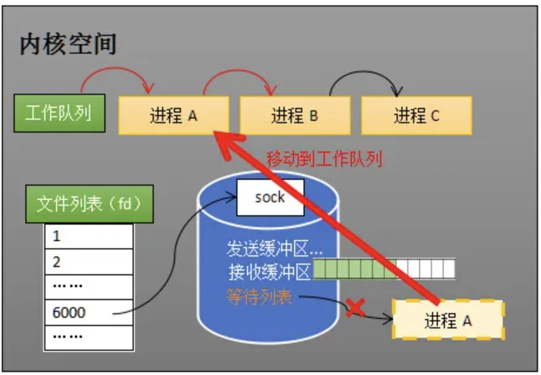

1.如何接收数据？网卡接收数据写入内存

2.如何知道接收了数据？网卡向CPU发送一个中断信号，CPU捕获这个信号，执行网卡中断程序去处理数据

3.什么是工作队列，什么是等待队列

4.接收数据全过程

步骤①：进程在recv阻塞期间，计算机收到了对端传送的数据

步骤②：数据经由网卡传送到内存

步骤③：网卡通过中断信号通知cpu有数据到达，cpu执行中断程序

中断程序主要有两项功能

步骤④：先将网络数据写入到对应socket的接收缓冲区里面

步骤⑤：再唤醒进程A，重新将进程A放入工作队列中

---

