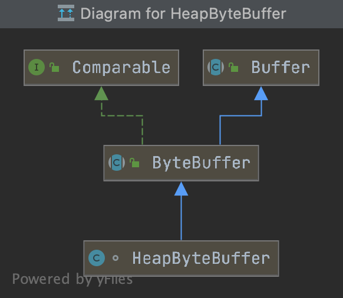

```java
//ByteBuffer实现类是HeapByteBuffer、
//HeapByteBuffer使用的是堆内内存
ByteBuffer buffer = ByteBuffer.allocate(10);
```



---

### 源码解析

#### Buffer

```java
public abstract class Buffer {
  private int mark = -1;
	private int position = 0;
	private int limit;
	private int capacity;
  
  //初始化:mark=-1,pos=0,lim=10,cap=10
  Buffer(int mark, int pos, int lim, int cap) {
    this.capacity = cap;
    limit(lim);
    position(pos);
    if (mark >= 0) {
      this.mark = mark;
    }
  }
  
  public final Buffer limit(int newLimit) {
    limit = newLimit;
    if (position > newLimit) position = newLimit;
    if (mark > newLimit) mark = -1;
    return this;
  }
  
  public final Buffer position(int newPosition) {
    if (mark > newPosition) mark = -1;
    position = newPosition;
    return this;
  }
  
  /**
   * 读取已经写入的数据
   */
  public final Buffer flip() {
    limit = position;
    position = 0;
    mark = -1;
    return this;
  }
  
  public final Buffer mark() {
    mark = position;
    return this;
  }
  
  public final Buffer reset() {
    int m = mark;
    position = m;
    return this;
  }
  
  /**
   * 恢复初始状态
   */
  public final Buffer clear() {
    position = 0;
    limit = capacity;
    mark = -1;
    return this;
  }
}
```

#### ByteBuffer

```java
public abstract class ByteBuffer extends Buffer implements Comparable<ByteBuffer> {
	final byte[] hb;
	final int offset;
  
  ByteBuffer(int mark, int pos, int lim, int cap, byte[] hb, int offset) {
    super(mark, pos, lim, cap);
    this.hb = hb;
    this.offset = offset;
  }
  
  public static ByteBuffer allocate(int capacity) {
    //capacity=10
    return new HeapByteBuffer(capacity, capacity);
  }
}
```

#### HeapByteBuffer

```java
class HeapByteBuffer extends ByteBuffer {
	HeapByteBuffer(int cap, int lim) {
    //创建一个byte数组,长度等于10
    super(-1, 0, lim, cap, new byte[cap], 0);
  }
  
  /**
   * 写入1个字节数据
   * position + 1
   */
  public ByteBuffer put(byte x) {
    hb[ix(nextPutIndex())] = x;
    return this;
  }
  
  /**
   * 读取1个字节数据
   * position + 1
   */
  public byte get() {
    return hb[ix(nextGetIndex())];
  }
  
  /**
   * 切割数组
   * 返回position到limit之间的数据
   */
  public ByteBuffer slice() {
    int pos = this.position();
    int lim = this.limit();
    int rem = (pos <= lim ? lim - pos : 0);
    return new HeapByteBuffer(hb,
                              -1,
                              0,
                              rem,
                              rem,
                              pos + offset);
  }
}
```

---

