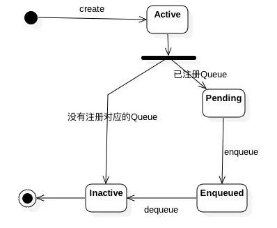
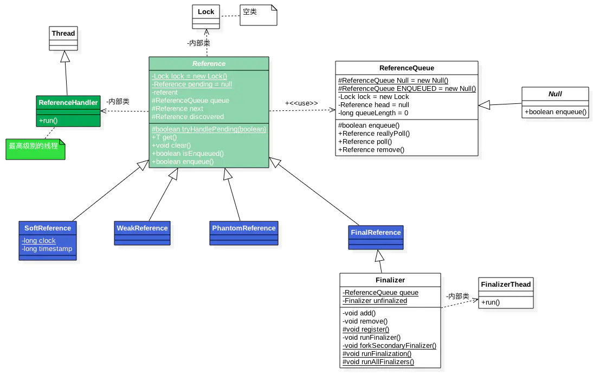

```java
软引用:在内存不足时回收,JVM会在抛出OOME前清理所有软引用指向的对象,如果清理完还是内存不足,才会抛出OOME
弱引用:GC就会回收些对象
虚引用:DirectByteBuffer中有其应用场景
```




```
新创建的对象状态为Active,GC的时候,如果对象的可达性处于合适的状态,垃圾回收器会切换实例的状态为Pending或Inactive
如果创建Reference注册了ReferenceQueue,则切换为Pending,并且Reference会加入到Reference#pending链表中,如果没有注册ReferenceQueue,会切换为Inactive
在Reference#pending链表中的Reference,等待ReferenceHandler线程将其加入到ReferenceQueue中
在ReferenceQueue队列中的Reference,如果Reference从队列中移除,进入Inactive状态
```

---



#### Reference

```java
public abstract class Reference<T> {
	//引用的对象
  private T referent;	
  //GC的时候当前Reference实例会被添加到这个队列中
  volatile ReferenceQueue<? super T> queue;
  
  //表示ReferenceQueue中下一个Reference
  volatile Reference next;
  
  /**
   * 跟pending配合,表示pending链表中的下一个元素
   */
  transient private Reference<T> discovered;
  
  /**
   * GC的时候JVM会把回收的Refrence添加到pending中
   * static修饰的全局共享,表示整个链表的头结点
   */
  private static Reference<Object> pending = null;
  
  /**
   * 从pending中取出Reference添加到ReferenceQueue
   */
  private static class ReferenceHandler extends Thread {
    private static void ensureClassInitialized(Class<?> clazz) {
      try {
        Class.forName(clazz.getName(), true, clazz.getClassLoader());
      } catch (ClassNotFoundException e) {
        throw (Error) new NoClassDefFoundError(e.getMessage()).initCause(e);
      }
    }
    
    static {
      //提前加载和初始化,防止运行的时候延迟、或者出现内存不足的问题
      ensureClassInitialized(InterruptedException.class);
      ensureClassInitialized(Cleaner.class);
    }
    
    public void run() {
      while (true) {
        tryHandlePending(true);
      }
    }
  }
  
  static boolean tryHandlePending(boolean waitForNotify) {
    Reference<Object> r;
    Cleaner c;
    try {
      synchronized (lock) {
        //判断pending链表中是否有数据
        if (pending != null) {
          r = pending;
          c = r instanceof Cleaner ? (Cleaner) r : null;
          //将r从pending链表中移除
          pending = r.discovered;
          r.discovered = null;
        } else {
          if (waitForNotify) {
            lock.wait();
          }
          return waitForNotify;
        }
      }
    } catch (OutOfMemoryError x) { 
    } catch (InterruptedException x) { 
    }
    //如果要回收的对象的引用是Cleaner类型,则调用clean方法进行资源回收
    //比如DirectByteBuffer中会创建一个Cleaner,处理堆外内存
    if (c != null) {
      c.clean();
      return true;
    }
    //如果创建Reference的时候使用了ReferenceQueue,则将Reference添加到对应的ReferenceQueue中
    ReferenceQueue<? super Object> q = r.queue;
    if (q != ReferenceQueue.NULL) q.enqueue(r);
    return true;
  }
  
  static {
    ThreadGroup tg = Thread.currentThread().getThreadGroup();
    for (ThreadGroup tgn = tg; tgn != null; tg = tgn, tgn = tg.getParent());
    //创建线程,并启动Daemon线程
    Thread handler = new ReferenceHandler(tg, "Reference Handler");
    handler.setPriority(Thread.MAX_PRIORITY);
    handler.setDaemon(true);
    handler.start();
  }
  
}
```

#### RefrenceQueue

```java
public class ReferenceQueue<T> {
	static ReferenceQueue<Object> NULL = new Null<>();
  static ReferenceQueue<Object> ENQUEUED = new Null<>();
	//头结点
  private volatile Reference<? extends T> head = null;
  //队列长度
  private long queueLength = 0;
  
	boolean enqueue(Reference<? extends T> r) {
    synchronized (lock) {
      ReferenceQueue<?> queue = r.queue;
      //判断Refrence是否需要入队
      if ((queue == NULL) || (queue == ENQUEUED)) {
        return false;
      }
      //改变下状态,表示入队了
      r.queue = ENQUEUED;
      //典型的队列入队操作
      r.next = (head == null) ? r : head;
      head = r;
      //队列长度+1
      queueLength++;
      lock.notifyAll();
      return true;
    }
  }
  
  private Reference<? extends T> reallyPoll() {
    Reference<? extends T> r = head;
    if (r != null) {
      //典型的队列出队操作
      Reference<? extends T> rn = r.next;
      head = (rn == r) ? null : rn;
      //改变下状态,表示出队了
      r.queue = NULL;
      r.next = r;
      //队列长度-1
      queueLength--;
      return r;
    }
    return null;
  }
  
  public Reference<? extends T> remove(long timeout) throws IllegalArgumentException, InterruptedException {
    synchronized (lock) {
      //出队
      Reference<? extends T> r = reallyPoll();
      if (r != null) return r;
      ...
    }
  }
  
}
```

#### PhantomReference(虚引用)

```java
public class PhantomReference<T> extends Reference<T> {
  public PhantomReference(T referent, ReferenceQueue<? super T> q) {
    super(referent, q);
  }
}
```

