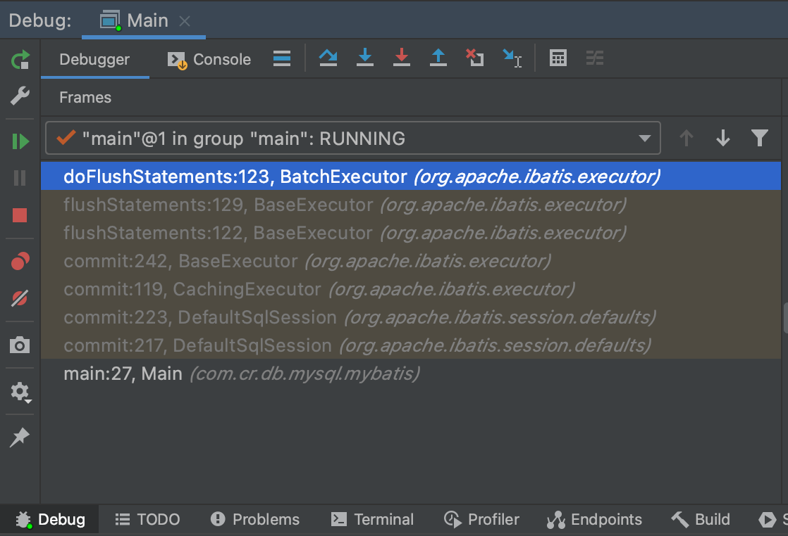

```
MySql的JDBC连接的url中要加rewriteBatchedStatements=true参数,并保证5.1.13以上版本的驱动,才能实现高性能的批量插入
MySQL的JDBC驱动在默认情况下会无视executeBatch()语句,会把我们期望批量执行的一组sql语句拆散,一条一条地发给MySQL数据库,直接造成较低的性能
```


#### 调用栈可以参考下图




#### 1.BatchExecutor#doUpdate

```java
public int doUpdate(MappedStatement ms, Object parameterObject) throws SQLException {
	final StatementHandler handler = configuration.newStatementHandler(this, ms, parameterObject, RowBounds.DEFAULT, null, null);
  handler.batch(stmt);
}
↓
↓
public void batch(Statement statement) throws SQLException {
  PreparedStatement ps = (PreparedStatement) statement;
  //addBatch
  ps.addBatch();
}
```

#### 2.BatchExecutor#doFlushStatements

```java
public List<BatchResult> doFlushStatements(boolean isRollback) throws SQLException {
	for (int i = 0, n = statementList.size(); i < n; i++) {
		Statement stmt = statementList.get(i);
    BatchResult batchResult = batchResultList.get(i);
    try {
      //executeBatch
			batchResult.setUpdateCounts(stmt.executeBatch());
    }
  }
}
```

#### 3.StatementImpl#executeBatch

```java
public int[] executeBatch() throws SQLException {
	return Util.truncateAndConvertToInt(executeBatchInternal());
}
```

#### 4.ClientPreparedStatement#executeBatchInternal

```java
protected long[] executeBatchInternal() throws SQLException {
	//如果rewriteBatchedStatements=true
  if (!this.batchHasPlainStatements && this.rewriteBatchedStatements.getValue()) {
		//INSERT语句的处理
    if (getParseInfo().canRewriteAsMultiValueInsertAtSqlLevel()) {
			return executeBatchedInserts(batchTimeout);
		}
    //UPDATE或者DELETE语句的处理
    //长度大于3
    if (!this.batchHasPlainStatements
        	&& this.query.getBatchedArgs() != null
            && this.query.getBatchedArgs().size() > 3) {
        return executePreparedBatchAsMultiStatement(batchTimeout);
    }
  }
  //如果rewriteBatchedStatements=false或者未配置则一条条执行
  return executeBatchSerially(batchTimeout);
}
```

