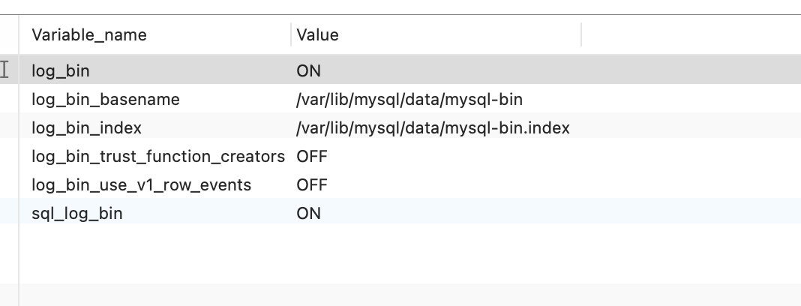
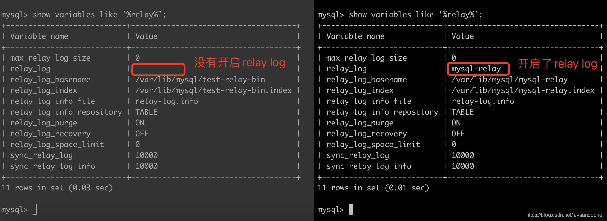

#### binlog

##### 开启binlog

```shell
[mysqld]
#
log-bin=/var/lib/mysql/filename
#5.7以上版本需要增加server-id,指定一个不能和其他集群中机器重名的字符串
server-id=123456
```

##### 查看binlog

```sql
show variables like '%log_bin%'
```



---

#### relaylog

##### 开启relaylog

```shell
[mysqld]
#启用中继日志，其中mysql-relay表示日志的文件名称，文件存放在datadir参数指向的目录下面，如果不修改参数datadir的值，默认为/var/lib/mysql这个目录。
#如果想自定义日志的路径，可以在这里指定文件的具体路径。例如配置为：relay-log=/data/log/relaylog/mysql-relay，则会在/data/log/relaylog目录下面，生成mysql-relay.000001这样的relay-log日志文件。
relay-log=mysql-relay
```

##### 查看relaylog

```sql
show variables like '%relay%'
```

