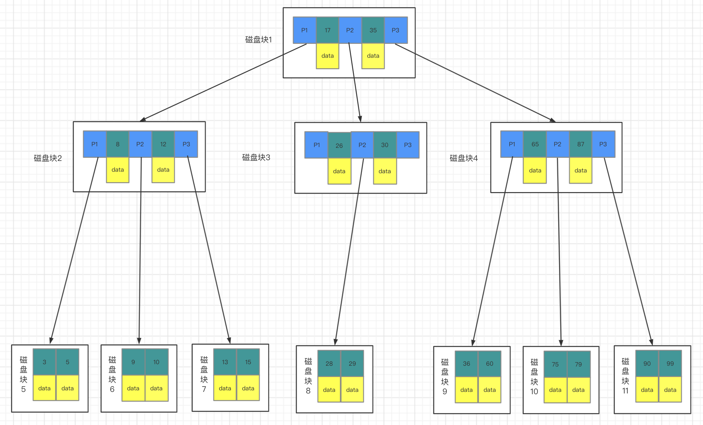
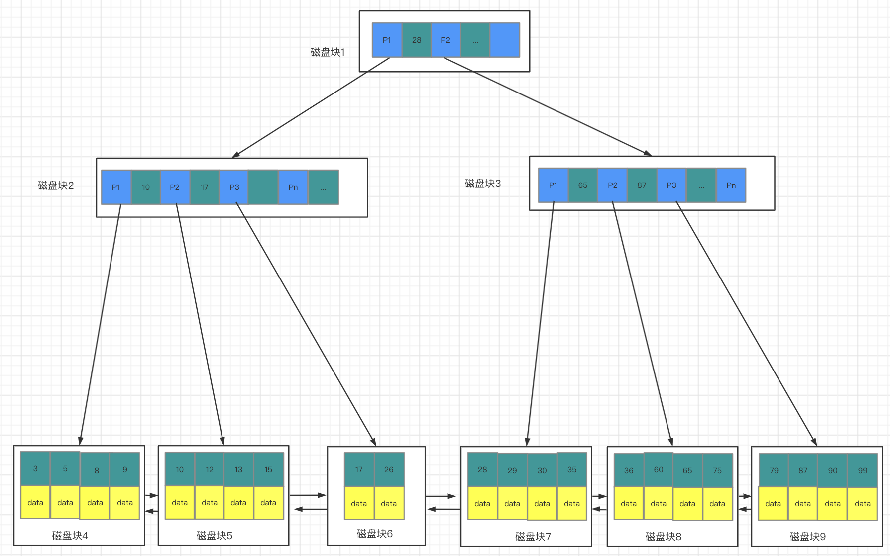
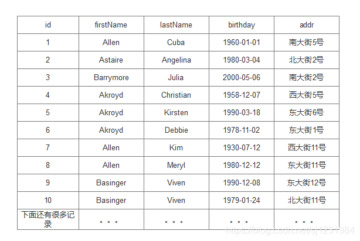
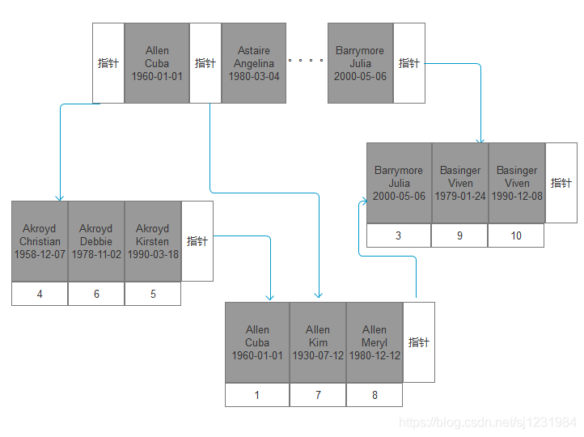

#### BTree



<!--17、35表示主键id，P1、P2表示磁盘块地址，data表示数据。-->

查找主键id等于28的data过程：

1. 读磁盘块1
2. 发现28可能在P2指向的地址内
3. 读磁盘块3
4. 发现28可能在P2指向的地址内
5. 读磁盘块8
6. 找到数据

##### BTree有什么缺点?

```
每个节点都会存储主键和data，如果data较大，将会导致每个节点存储的key数量变少。
当数据量很大时会导致整个树的深度较深，进而增加磁盘I/O次数。
```

---

#### B+Tree

非叶子节点存储主键id和磁盘块地址，叶子节点存储主键id和数据。



---

#### 联合索引对应的B+tree结构

对firstName、lastName、birthday这三列建立一个联合索引。



索引首先会按照firstName排序即按照字母顺序排列，firstName相同的情况下按照lastName排序，lastName相同的情况下再按照birthday排序。



---


