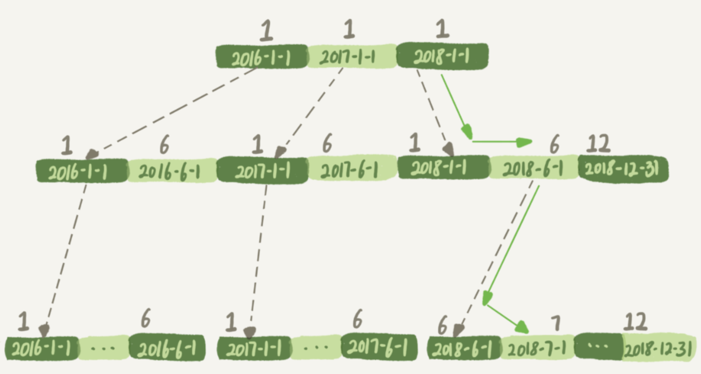
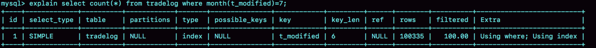

### 索引字段上函数计算导致索引失效

```sql
CREATE TABLE `tradelog` (
  `id` int(11) NOT NULL,
  `tradeid` varchar(32) DEFAULT NULL,
  `operator` int(11) DEFAULT NULL,
  `t_modified` datetime DEFAULT NULL,
  PRIMARY KEY (`id`),
  KEY `tradeid` (`tradeid`),
  KEY `t_modified` (`t_modified`)
) ENGINE=InnoDB DEFAULT CHARSET=utf8mb4;
```

#### 1.month函数导致索引失效

t_modified索引的示意图



方框上面的值表示month函数计算的值

```sql
-- month函数会导致t_modified索引失效
-- 如果使用where t_modified='2018-7-1’，会按照上面绿色箭头的路线，找到想要的结果
-- 如果使用month()函数的话，就会看到传入7的时候，在树的第一层就不知道该怎么办了
-- 也就是说对索引字段做函数操作,很可能会破坏索引值的有序性
select count(*) from tradelog where month(t_modified)=7;
```

explain结果

key=t_modified：表示的是使用了t_modified这个索引
rows=100335：表示这条SQL扫描了整个索引的所有值
Extra中的Using index：表示的是使用了覆盖索引



```
MySQL可以选择遍历主键索引，也可以选择遍历t_modified索引，但是对比索引大小后发现，t_modified索引更小，这也就以为着遍历t_modified索引比遍历主键索引更快
```

MySQL在个问题上确实有“偷懒”行为，即使是对于不改变有序性的函数，也不会考虑使用索引

```sql
-- 这个SQL加1操作并不会改变有序性，但是MySQL优化器还是不能用id索引快速定位到9999这一行
-- 但是改写成where id = 10000 - 1可以
select * from tradelog where id + 1 = 10000
```

#### 2.varchar和数字比较导致索引失效

```sql
-- 返回0，表示小于
select "10" > "9"

-- 在MySQL中，字符串和数字做比较的话，是将字符串转换成数字
-- 返回1，表示大于
-- "10"会变成数字10
select "10" > 9

-- 这个语句相当于select * from tradelog where CAST(tradid AS signed int) = 110717
-- 对索引字段tradid做了CAST函数操作
-- tradeid的索引是按照字符串排序的，CAST函数转换后成为数字，字符串排序规则对这个数字失效，所以导致MySQL放弃走树搜索功能
-- 反过来，如果tradeid是int类型，使用where tradeid="110717"就会走树搜索功能了，因为"110717"会被转成数字
select * from tradelog where tradeid=110717;
```

---

https://funnylog.gitee.io/mysql45/18%E8%AE%B2%E4%B8%BA%E4%BB%80%E4%B9%88%E8%BF%99%E4%BA%9BSQL%E8%AF%AD%E5%8F%A5%E9%80%BB%E8%BE%91%E7%9B%B8%E5%90%8C%EF%BC%8C%E6%80%A7%E8%83%BD%E5%8D%B4%E5%B7%AE%E5%BC%82%E5%B7%A8%E5%A4%A7.html

