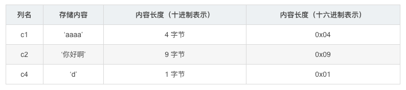
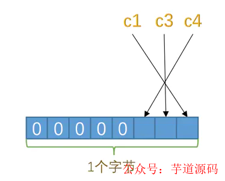
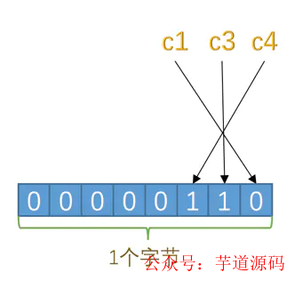

```
我们平时是以记录为单位来向表中插入数据的，这些记录在磁盘上的存放方式也被称为行格式或者记录格式
行格式有4种，分别是Dynamic、Compact、Redundant和Compressed
```

---

###Dynamic行格式（InnoDB默认行格式）

记录的额外信息和记录的真实数据两部分


#### 变长字段长度列表

比如varchar类型占用的存储空间会分为两部分

- 真正的数据内容部分，放在对应的列
- 真实占用的字节数，放在变长字段列表部分（每个字段最多会用两个字节表示长度，所以范围是2^16-1）

如果1行数据有3个varchar列c1、c2、c3，内容如下：

那么各变长字段数据占用的字节数长度会按照列的顺序逆序存放，如c1字节长度等于4，放到最后，c2字节长度等于9，放到第2个位置，以此类推


##### 为什么使用utf8mb4字符集varchar长度最大是16383？

```
utf8mb4最大使用4个字节表示一个字符（utf8最大使用3个字节）
变长字段列表中varchar字段最多使用2个字节16位表示字节长度，所以能表示的最大长度是65535（2^16-1）
最大字节数/编码最大使用的字节数 = 65535/4 = 16383.75
```


#### NULL值列表

如果表中的某些列可能存储NULL值，把这些NULL值都放到记录的真实数据中存储会很占地方，所以Dynamic行格式把这些值为NULL的列统一管理起来，存储到NULL值列表中

将每个允许存储NULL的列对应一个二进制位，二进制位按照列的顺序逆序排列

如下所示，c1、c2、c3的顺序


只有3个字段允许为NULL，对应3个二进制位，不足1字节，那么就在高位补0即可

如下所示，可以表示8个列为NULL的情况



二进制位的值为1时，代表该列的值为NULL，为0时，代表该列的值不为NULL



如果c3、c4都是NULL，对应的二进制位为1，十六进制表示就是0x06


---

[https://mp.weixin.qq.com/s/M5P7zNRi6biI7IcY7jezQg]:MySQL的varchar水真的太深了，你真的会用吗？

