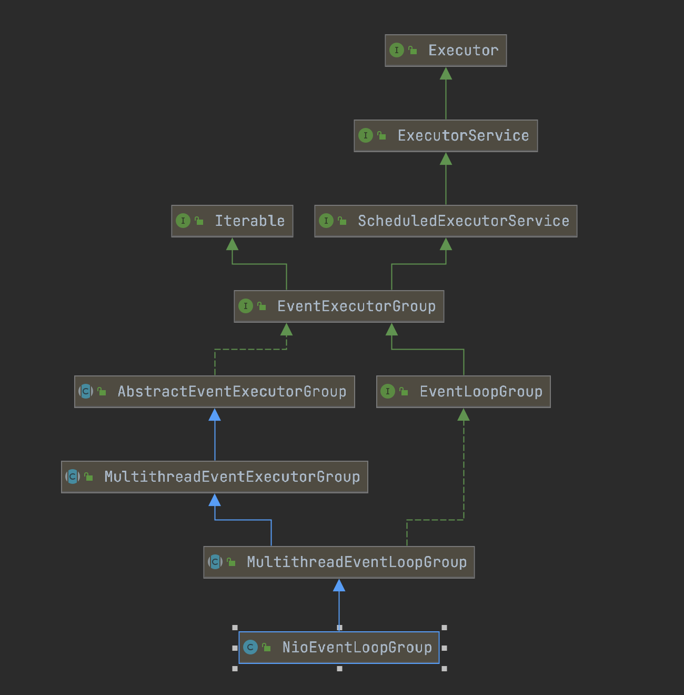
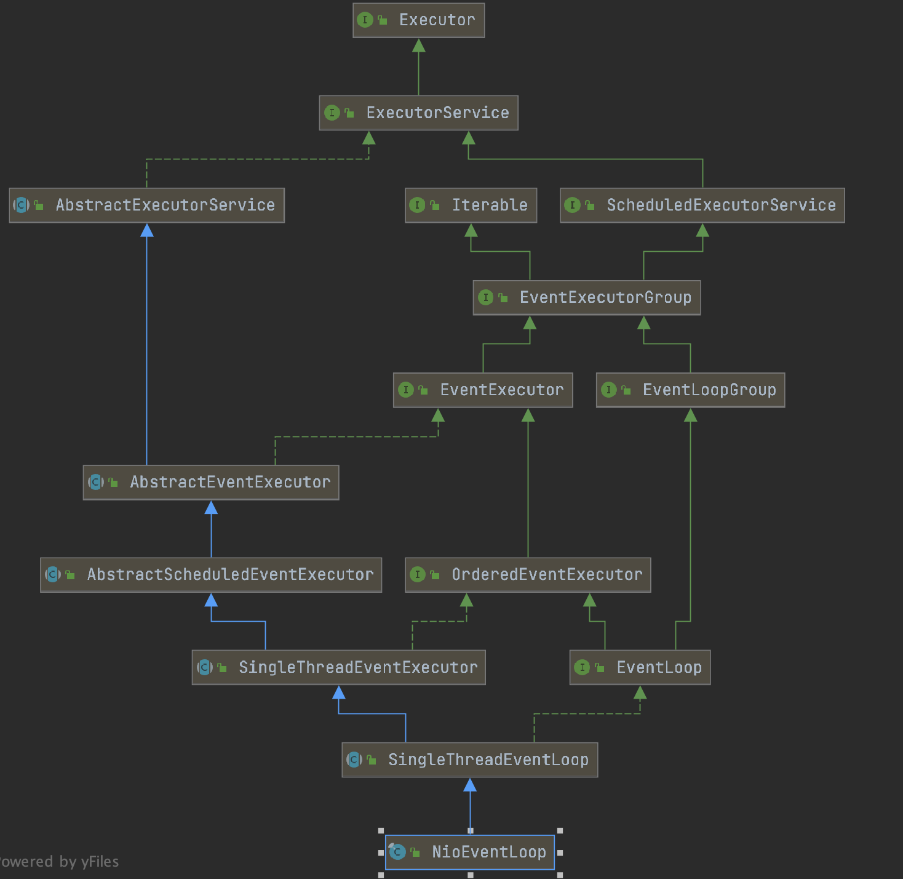

##### NioEventLoopGroup的重要属性

```java
/**MultithreadEventExecutorGroup中定义*/
private final EventExecutor[] children;                                 //NioEventLoop的数组
private final EventExecutorChooserFactory.EventExecutorChooser chooser; //选择NioEventLoop的算法
```

##### NioEventLoop的重要属性

```java
/**SingleThreadEventExecutor中定义*/
private volatile Thread thread;
private final Executor executor;

/**NioEventLoop中定义*/
private Selector selector;
private Selector unwrappedSelector;
private final SelectStrategy selectStrategy;
```

---



##### 1.NioEventLoopGroup的构造函数

```java
public NioEventLoopGroup() {
  this(0);
}
↓
public NioEventLoopGroup(int nThreads) {
  this(nThreads, (Executor) null);
}
↓
public NioEventLoopGroup(int nThreads, Executor executor) {
	//Java NIO的SelectorProvider
  this(nThreads, executor, SelectorProvider.provider());
}
↓
public NioEventLoopGroup(int nThreads, Executor executor, final SelectorProvider selectorProvider) {
  this(nThreads, executor, selectorProvider, DefaultSelectStrategyFactory.INSTANCE);
}
↓
public NioEventLoopGroup(int nThreads, Executor executor, final SelectorProvider selectorProvider,
                         final SelectStrategyFactory selectStrategyFactory) {
  super(nThreads, executor, selectorProvider, selectStrategyFactory, RejectedExecutionHandlers.reject()); //2
}
```

##### 2.MultithreadEventLoopGroup的构造函数

```java
protected MultithreadEventLoopGroup(int nThreads, Executor executor, Object... args) {
  //创建NioEventLoop的数量默认等于CPU核数 * 2
  super(nThreads == 0 ? DEFAULT_EVENT_LOOP_THREADS : nThreads, executor, args);
}
```

##### 3.MultithreadEventExecutorGroup的构造函数

```java
protected MultithreadEventExecutorGroup(int nThreads, Executor executor, Object... args) {
  this(nThreads, executor, DefaultEventExecutorChooserFactory.INSTANCE, args);
}
↓
protected MultithreadEventExecutorGroup(int nThreads, Executor executor, EventExecutorChooserFactory chooserFactory, 
                                        Object... args) {
  if (executor == null) {
  	executor = new ThreadPerTaskExecutor(newDefaultThreadFactory());
  }
  
  children = new EventExecutor[nThreads];
  
  for (int i = 0; i < nThreads; i ++) {
    children[i] = newChild(executor, args); //4
  }

  //nThreads是2的3次方，返回PowerOfTwoEventExecutorChooser
  chooser = chooserFactory.newChooser(children);
}
```

##### 4.NioEventLoopGroup#newChild

```java
protected EventLoop newChild(Executor executor, Object... args) {
  //<源码解析-1.1.1初始化NioEventLoop>
  return new NioEventLoop(
    this, executor,
    (SelectorProvider) args[0],
    ((SelectStrategyFactory) args[1]).newSelectStrategy(),
    (RejectedExecutionHandler) args[2]);
}
```



##### 5.NioEventLoop的构造函数

```java
NioEventLoop(NioEventLoopGroup parent, Executor executor,
             SelectorProvider selectorProvider,
             SelectStrategy strategy,
             RejectedExecutionHandler rejectedExecutionHandler) {
  super(parent, executor, false, DEFAULT_MAX_PENDING_TASKS, rejectedExecutionHandler);

  provider = selectorProvider;
  final SelectorTuple selectorTuple = openSelector();
  selector = selectorTuple.selector;
  unwrappedSelector = selectorTuple.unwrappedSelector;
  selectStrategy = strategy;
}
```

##### 6.SingleThreadEventLoop的构造函数

```java
protected SingleThreadEventLoop(EventLoopGroup parent, Executor executor,
                                boolean addTaskWakesUp, int maxPendingTasks,
                                RejectedExecutionHandler rejectedExecutionHandler) {
  super(parent, executor, addTaskWakesUp, maxPendingTasks, rejectedExecutionHandler);
  tailTasks = newTaskQueue(maxPendingTasks);
}
```

##### 7.SingleThreadEventExecutor的构造函数

```java
protected SingleThreadEventExecutor(EventExecutorGroup parent, Executor executor,
                                    boolean addTaskWakesUp, int maxPendingTasks,
                                    RejectedExecutionHandler rejectedHandler) {
  super(parent);
  this.addTaskWakesUp = addTaskWakesUp;
  this.maxPendingTasks = Math.max(16, maxPendingTasks);
  this.executor = ObjectUtil.checkNotNull(executor, "executor");
  taskQueue = newTaskQueue(this.maxPendingTasks);
  rejectedExecutionHandler = ObjectUtil.checkNotNull(rejectedHandler, "rejectedHandler");
}
```

##### 8.AbstractScheduledEventExecutor的构造函数

```java
protected AbstractScheduledEventExecutor(EventExecutorGroup parent) {
  super(parent);
}
```

##### 9.AbstractEventExecutor的构造函数

```java
protected AbstractEventExecutor(EventExecutorGroup parent) {
  this.parent = parent;
}
```

