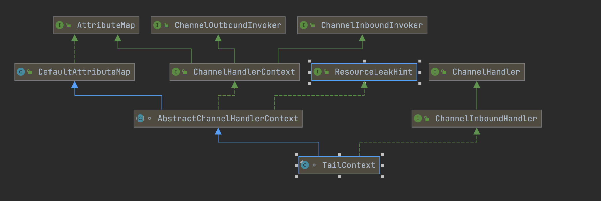
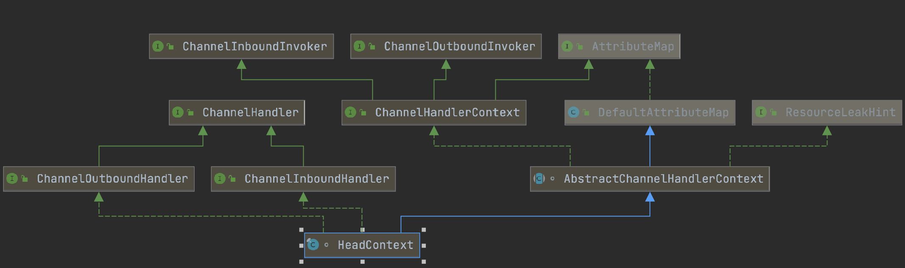

#### DefaultChannelPipeline的重要属性

```java
/**
 * DefaultChannelPipeline中定义
 */
final AbstractChannelHandlerContext head;
final AbstractChannelHandlerContext tail;
private final Channel channel;
```

---

##### 1.DefaultChannelPipeline的构造函数

```java
protected DefaultChannelPipeline(Channel channel) {
  this.channel = ObjectUtil.checkNotNull(channel, "channel");

  tail = new TailContext(this); //2
  head = new HeadContext(this); //3

  //创建双向链表
  head.next = tail;
  tail.prev = head;
}
```



##### 2.TailContext的构造函数

```java
TailContext(DefaultChannelPipeline pipeline) {
  //inbound等于true
  //outbound等于false
  //HEAD_NAME等于"TailContext#0"
  super(pipeline, null, TAIL_NAME, true, false); //4
  setAddComplete();
}
```



##### 3.HeadContext的构造函数

```java
HeadContext(DefaultChannelPipeline pipeline) {
  //inbound等于false
  //outbound等于true
  //HEAD_NAME等于"HeadContext#0"
  super(pipeline, null, HEAD_NAME, false, true); //4
  unsafe = pipeline.channel().unsafe();
  setAddComplete();
}
```

##### 4.AbstractChannelHandlerContext

```java
AbstractChannelHandlerContext(
  DefaultChannelPipeline pipeline, EventExecutor executor, String name,
  boolean inbound, boolean outbound) {
	this.name = ObjectUtil.checkNotNull(name, "name");
  this.pipeline = pipeline;
  this.executor = executor;
  this.inbound = inbound;
  this.outbound = outbound;
}
```

---
