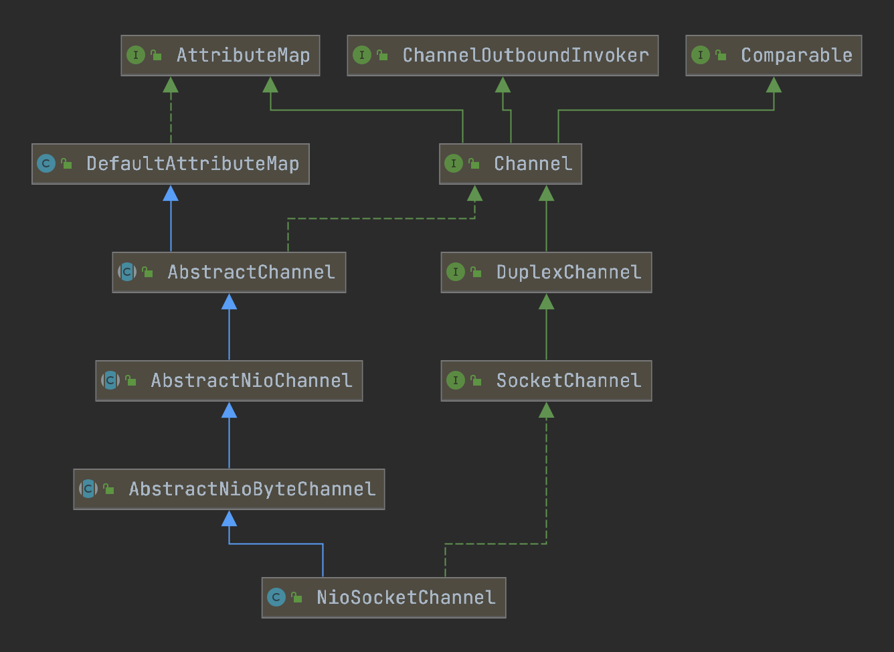

#### NioSocketChannel的重要属性

```java
/**
 * AbstractChannel中定义
 */
private final Unsafe unsafe;                      //实现类为NioSocketChannelUnsafe
private final DefaultChannelPipeline pipeline;
private volatile EventLoop eventLoop;             //NioEventLoop

/**
 * AbstractNioChannel中定义
 */
private final SelectableChannel ch;               //Java NIO SocketChannel
protected final int readInterestOp;               //IO的事件,OP_READ等
volatile SelectionKey selectionKey;               //Java NIO SelectionKey

/**
 * NioSocketChannel中定义
 */
private final SocketChannelConfig config;         //NioSocketChannel的配置类
```

---



##### 1.NioSocketChannel的构造函数

```java
public NioSocketChannel() {
  //Java NIO SelectorProvider
  this(DEFAULT_SELECTOR_PROVIDER);
}
↓
public NioSocketChannel(SelectorProvider provider) {
  //newSocket方法会创建一个Java NIO SocketChannel
  this(newSocket(provider));
}
↓
public NioSocketChannel(SocketChannel socket) {
  this(null, socket);
}
↓
public NioSocketChannel(Channel parent, SocketChannel socket) {
  super(parent, socket);
  config = new NioSocketChannelConfig(this, socket.socket());
}
↓
protected AbstractNioByteChannel(Channel parent, SelectableChannel ch) {
  //OP_READ事件
  super(parent, ch, SelectionKey.OP_READ);
}
↓
protected AbstractNioChannel(Channel parent, SelectableChannel ch, int readInterestOp) {
  super(parent);
  this.ch = ch;
  this.readInterestOp = readInterestOp;
  //设置非阻塞
  ch.configureBlocking(false);
}
↓
↓
protected AbstractChannel(Channel parent) {
	this.parent = parent;
  id = newId();
  unsafe = newUnsafe(); //2.1
  pipeline = newChannelPipeline(); //2.2
}
```

##### 2.1.NioSocketChannle#newUnsafe

```java
protected AbstractNioUnsafe newUnsafe() {
  return new NioSocketChannelUnsafe();
}
```

##### 2.2.AbstractChannel#newChannelPipeline

```java
protected DefaultChannelPipeline newChannelPipeline() {
  //<源码解析-1.2.1初始化DefaultChannelPipeline>
  return new DefaultChannelPipeline(this);
}
```

---
