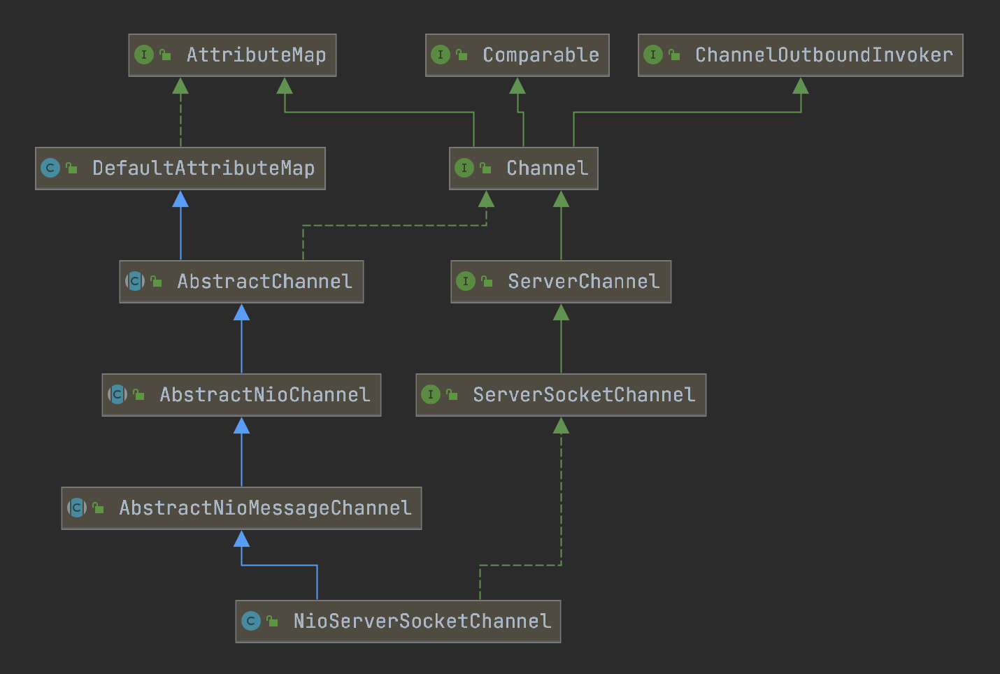

##### 1.NioServerSocketChannel的构造函数



```java
public NioServerSocketChannel() {
 	//newSocket方法会创建一个Java NIO ServerSocketChannel
  this(newSocket(DEFAULT_SELECTOR_PROVIDER));
}
↓
public NioServerSocketChannel(ServerSocketChannel channel) {
  super(null, channel, SelectionKey.OP_ACCEPT);
  config = new NioServerSocketChannelConfig(this, javaChannel().socket());
}
↓
protected AbstractNioMessageChannel(
  Channel parent, SelectableChannel ch, int readInterestOp) {
  super(parent, ch, readInterestOp);
}
↓
protected AbstractNioChannel(
  Channel parent, SelectableChannel ch, int readInterestOp) {
  super(parent);
  this.ch = ch;
  this.readInterestOp = readInterestOp;
  //设置非阻塞
  ch.configureBlocking(false);
}
↓
protected AbstractChannel(Channel parent) {
  this.parent = parent;
  id = newId();
  unsafe = newUnsafe();
  pipeline = newChannelPipeline();
}
```

---