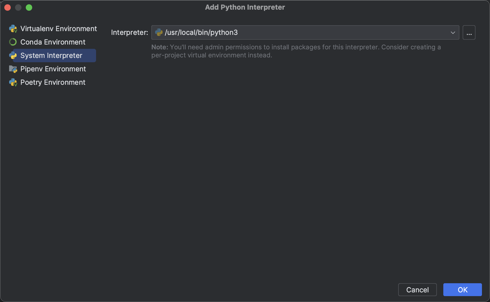

# Mac

##### 1.选择版本下载安装：https://www.python.org/downloads/macos/

##### 2.查看路径

```
which python3
↓
↓
/usr/local/bin/python3
↓
↓
python3 -> ../../../Library/Frameworks/Python.framework/Versions/3.10/bin/python3
```

##### 3.PyCharm选择解释器

