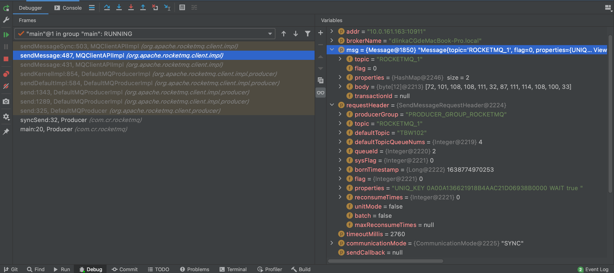
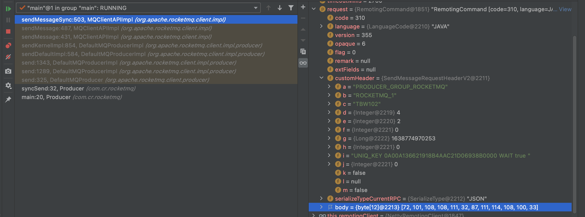
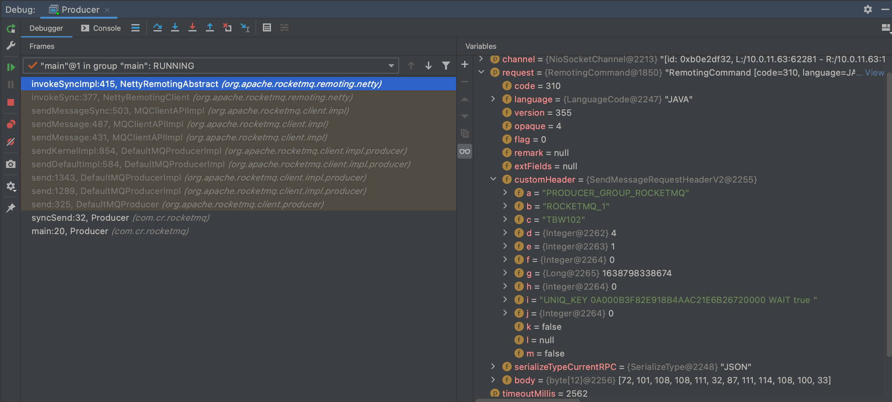
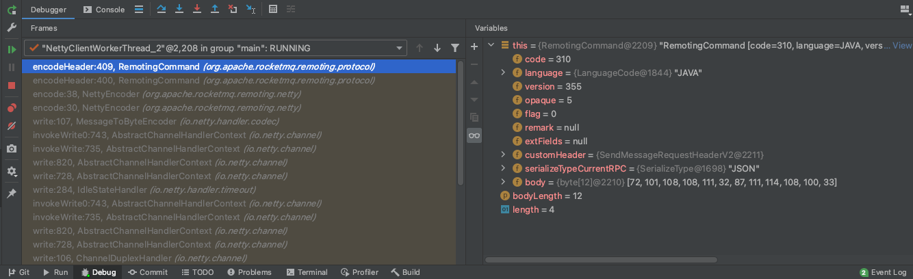
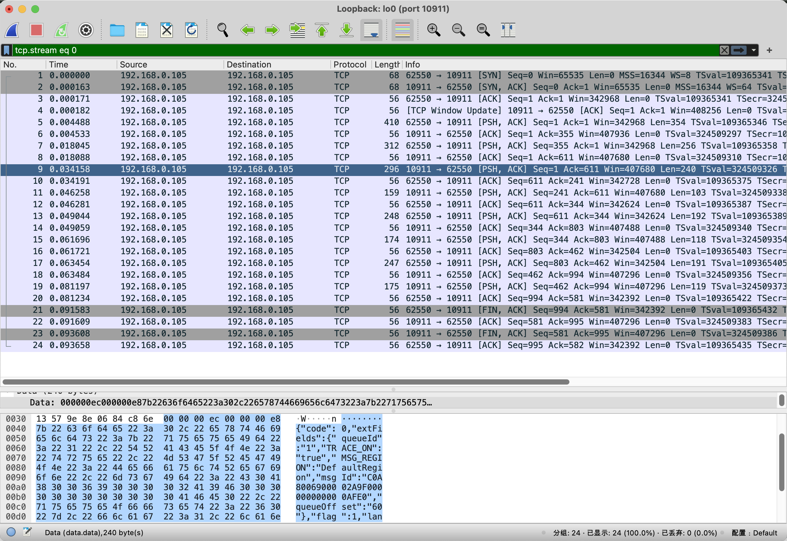

#### 1.DefaultMQProducer#send

```java
public SendResult send(Message msg) {
  return this.defaultMQProducerImpl.send(msg);
}
↓
↓
//DefaultMQProducerImpl#send
public SendResult send(Message msg) {
  return send(msg, this.defaultMQProducer.getSendMsgTimeout());
}
↓
↓
//DefaultMQProducerImpl#send
public SendResult send(Message msg, long timeout) {
  //同步发送消息
  return this.sendDefaultImpl(msg, CommunicationMode.SYNC, null, timeout);
}
↓
↓
//DefaultMQProducerImpl#sendDefaultImpl
private SendResult sendDefaultImpl(Message msg,
                                   final CommunicationMode communicationMode,
                                   final SendCallback sendCallback,
                                   final long timeout) {
  //获取TopicPublishInfo
	TopicPublishInfo topicPublishInfo = this.tryToFindTopicPublishInfo(msg.getTopic()); //2
  
  //根据TopicPublishInfo随机选择一个MessageQueue
	MessageQueue mqSelected = this.selectOneMessageQueue(topicPublishInfo, lastBrokerName); //3
  
  //发送
	SendResult sendResult = this.sendKernelImpl(msg, mq, communicationMode, sendCallback, topicPublishInfo, timeout - costTime); //4
  
  switch (communicationMode) {
  	case SYNC:
      //直接返回
      return sendResult;
  }
}
```

#### 2.DefaultMQProducerImpl#tryToFindTopicPublishInfo

```java
private TopicPublishInfo tryToFindTopicPublishInfo(final String topic) {
	TopicPublishInfo topicPublishInfo = this.topicPublishInfoTable.get(topic);
  if (null == topicPublishInfo || !topicPublishInfo.ok()) {
    //从NameServer获取TopicRouteData,然后根据TopicRouteData构建TopicPublishInfo
    this.mQClientFactory.updateTopicRouteInfoFromNameServer(topic); //2.1
    topicPublishInfo = this.topicPublishInfoTable.get(topic);
  }

  if (topicPublishInfo.isHaveTopicRouterInfo() || topicPublishInfo.ok()) {
    return topicPublishInfo;
  }
}
```

#### 2.1.MQClientInstance#updateTopicRouteInfoFromNameServer

```java
public boolean updateTopicRouteInfoFromNameServer(final String topic) {
  return updateTopicRouteInfoFromNameServer(topic, false, null);
}
↓
↓
public boolean updateTopicRouteInfoFromNameServer(final String topic, boolean isDefault, DefaultMQProducer defaultMQProducer) {
  TopicRouteData topicRouteData;
  else {
   //从NameServer获取TopicRouteData信息
   topicRouteData = this.mQClientAPIImpl.getTopicRouteInfoFromNameServer(topic, 1000 * 3); //2.2
  }
  if (topicRouteData != null) {
  	TopicRouteData old = this.topicRouteTable.get(topic);
		//判断和之前的TopicRouteData是否一致
    boolean changed = topicRouteDataIsChange(old, topicRouteData);
    
    //如果发生变化
    if(changed){
      TopicRouteData cloneTopicRouteData = topicRouteData.cloneTopicRouteData();

      //根据TopicRouteDate创建TopicPublishInfo
      {
      	TopicPublishInfo publishInfo = topicRouteData2TopicPublishInfo(topic, topicRouteData);
      	publishInfo.setHaveTopicRouterInfo(true);
        Iterator<Entry<String, MQProducerInner>> it = this.producerTable.entrySet().iterator();
        while (it.hasNext()) {
          Entry<String, MQProducerInner> entry = it.next();
          MQProducerInner impl = entry.getValue();
					//DefaultMQProducerImpl#topicPublishInfoTable
          impl.updateTopicPublishInfo(topic, publishInfo);
        }
      }
      
      //MQClientInstance#topicRouteTable
      this.topicRouteTable.put(topic, cloneTopicRouteData);
      return true;
    }
  }
}
↓
↓
public static TopicPublishInfo topicRouteData2TopicPublishInfo(final String topic, final TopicRouteData route) {
	//创建TopicPublishInfo
  TopicPublishInfo info = new TopicPublishInfo();
  //设置TopicRouteData
  info.setTopicRouteData(route);
  
  else {
    List<QueueData> qds = route.getQueueDatas();
    for (QueueData qd : qds) {
      //判断是否可写
      if (PermName.isWriteable(qd.getPerm())) {
        //默认创建4个MessageQueue
        for (int i = 0; i < qd.getWriteQueueNums(); i++) {
          MessageQueue mq = new MessageQueue(topic, qd.getBrokerName(), i);
          info.getMessageQueueList().add(mq);
        }
      }
    }
  }
  return info;
}
```

#### 2.2.MQClientAPIImpl#getTopicRouteInfoFromNameServer

```java
public TopicRouteData getTopicRouteInfoFromNameServer(final String topic, final long timeoutMillis) {
  return getTopicRouteInfoFromNameServer(topic, timeoutMillis, true);
}
↓
↓
public TopicRouteData getTopicRouteInfoFromNameServer(final String topic, final long timeoutMillis, boolean allowTopicNotExist) {
  //创建请求头
  GetRouteInfoRequestHeader requestHeader = new GetRouteInfoRequestHeader();
  requestHeader.setTopic(topic);
  RemotingCommand request = RemotingCommand.createRequestCommand(RequestCode.GET_ROUTEINFO_BY_TOPIC, requestHeader);
	
  //从NameServer获取Topic的路由信息
  RemotingCommand response = this.remotingClient.invokeSync(null, request, timeoutMillis);
  
  switch (response.getCode()) {
  	case ResponseCode.SUCCESS: {
      return TopicRouteData.decode(response.getBody(), TopicRouteData.class);
    }
  }
}
```

#### 3.DefaultMQProducerImpl#selectOneMessageQueue

```java
public MessageQueue selectOneMessageQueue(final TopicPublishInfo tpInfo, final String lastBrokerName) {
  return this.mqFaultStrategy.selectOneMessageQueue(tpInfo, lastBrokerName);
}
↓
↓
//MQFaultStrategy#selectOneMessageQueue
public MessageQueue selectOneMessageQueue(final TopicPublishInfo tpInfo, final String lastBrokerName) {
	return tpInfo.selectOneMessageQueue(lastBrokerName);
}
↓
↓
//TopicPublishInfo#selectOneMessageQueue
public MessageQueue selectOneMessageQueue(final String lastBrokerName) {
  if (lastBrokerName == null) {
    return selectOneMessageQueue();
  }
}
↓
↓
//TopicPublishInfo#selectOneMessageQueue
public MessageQueue selectOneMessageQueue() {
  int index = this.sendWhichQueue.getAndIncrement();
  int pos = Math.abs(index) % this.messageQueueList.size();
  return this.messageQueueList.get(pos);
}
↓
↓
//ThreadLocalIndex#getAndIncrement
public int getAndIncrement() {
  Integer index = this.threadLocalIndex.get();
  if (null == index) {
    //随机一个int
    index = Math.abs(random.nextInt());
    this.threadLocalIndex.set(index);
  }
  //index + 1
  index = Math.abs(index + 1);
  this.threadLocalIndex.set(index);
  return index;
}
```

#### 4.DefaultMQProducerImpl#sendKernelImpl

```java
private SendResult sendKernelImpl(final Message msg, final MessageQueue mq, final CommunicationMode communicationMode, final SendCallback sendCallback, final TopicPublishInfo topicPublishInfo, final long timeout)
  //IP:PORT
  String brokerAddr = this.mQClientFactory.findBrokerAddressInPublish(mq.getBrokerName());

  if(brokerAddr != null) {
    //是否开启了"VIP"通道,默认不开启
    brokerAddr = MixAll.brokerVIPChannel(this.defaultMQProducer.isSendMessageWithVIPChannel(), brokerAddr);

    try {
      //不是批量消息,设置UNIQ_KEY
      if (!(msg instanceof MessageBatch)) {
        MessageClientIDSetter.setUniqID(msg);
      }

      SendMessageRequestHeader requestHeader = new SendMessageRequestHeader();
      requestHeader.setProducerGroup(this.defaultMQProducer.getProducerGroup());
      requestHeader.setTopic(msg.getTopic());
      requestHeader.setDefaultTopic("TBW102");
      requestHeader.setDefaultTopicQueueNums(4);
      requestHeader.setQueueId(mq.getQueueId());
      requestHeader.setSysFlag(sysFlag);
      requestHeader.setBornTimestamp(System.currentTimeMillis());
      requestHeader.setFlag(msg.getFlag());
      requestHeader.setProperties(MessageDecoder.messageProperties2String(msg.getProperties()));
      requestHeader.setReconsumeTimes(0);
      requestHeader.setUnitMode(false);
      requestHeader.setBatch(msg instanceof MessageBatch);

      SendResult sendResult = null;
      switch (communicationMode) {
        case SYNC:
          sendResult = this.mQClientFactory.getMQClientAPIImpl().sendMessage(
            brokerAddr,
            mq.getBrokerName(),
            msg,
            requestHeader,
            timeout - costTimeSync,
            communicationMode,
            context,
            this);
          break;
      }
      
      return sendResult;
    }
  }
}
↓
↓
//MQClientAPIImpl#sendMessage
public SendResult sendMessage(
        final String addr,
        final String brokerName,
        final Message msg,
        final SendMessageRequestHeader requestHeader,
        final long timeoutMillis,
        final CommunicationMode communicationMode,
        final SendMessageContext context,
        final DefaultMQProducerImpl producer) {
  return sendMessage(addr, brokerName, msg, requestHeader, timeoutMillis, communicationMode, null, null, null, 0, context, producer);
}
↓
↓
//MQClientAPIImpl#sendMessage
public SendResult sendMessage(
        final String addr,
        final String brokerName,
        final Message msg,
        final SendMessageRequestHeader requestHeader,
        final long timeoutMillis,
        final CommunicationMode communicationMode,
        final SendCallback sendCallback,
        final TopicPublishInfo topicPublishInfo,
        final MQClientInstance instance,
        final int retryTimesWhenSendFailed,
        final SendMessageContext context,
        final DefaultMQProducerImpl producer) {
  RemotingCommand request = null;
  if (sendSmartMsg || msg instanceof MessageBatch) {
    //轻量数据体
    SendMessageRequestHeaderV2 requestHeaderV2 = SendMessageRequestHeaderV2.createSendMessageRequestHeaderV2(requestHeader);
    request = RemotingCommand.createRequestCommand(RequestCode.SEND_MESSAGE_V2, requestHeaderV2);
  }
  //设置请求体
  request.setBody(msg.getBody());
  
  switch (communicationMode) {
  	case SYNC:
      return this.sendMessageSync(addr, brokerName, msg, timeoutMillis - costTimeSync, request);
  }
}
↓
↓
//MQClientAPIImpl#sendMessageSync
private SendResult sendMessageSync(
        final String addr,
        final String brokerName,
        final Message msg,
        final long timeoutMillis,
        final RemotingCommand request) {
  //发送请求
  RemotingCommand response = this.remotingClient.invokeSync(addr, request, timeoutMillis);
  return this.processSendResponse(brokerName, msg, response);
}
```

#### MQClientAPIImpl#sendMessage

#### MQClientAPIImpl#sendMessageSync

#### NettyRemotingAbstract#invokeSyncImpl



#### RemotingCommand#encodeHeader



---



