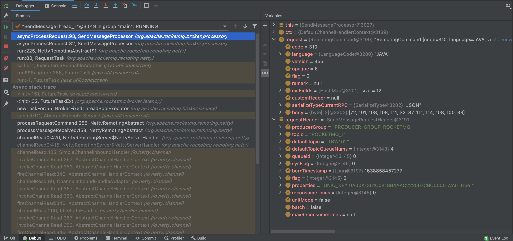
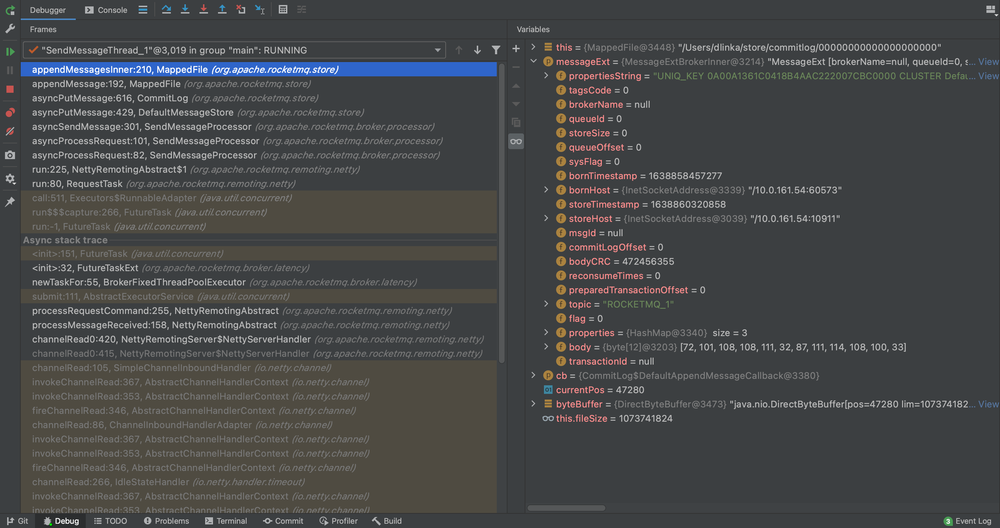

#### 1.NettyRemotingAbstract#processMessageReceived

**NettyRemotingAbstract是NettyRemotingServer的父类**

```java
public void processMessageReceived(ChannelHandlerContext ctx, RemotingCommand msg) throws Exception {
  switch (cmd.getType()) {
    case REQUEST_COMMAND:
      processRequestCommand(ctx, cmd);
  }
}
↓
↓
public void processRequestCommand(final ChannelHandlerContext ctx, final RemotingCommand cmd) {
  final Pair<NettyRequestProcessor, ExecutorService> matched = this.processorTable.get(cmd.getCode());
	//线程池运行的Runnable
  Runnable run = new Runnable() {
    public void run() {
      if (pair.getObject1() instanceof AsyncNettyRequestProcessor) {
        AsyncNettyRequestProcessor processor = (AsyncNettyRequestProcessor)pair.getObject1();
        processor.asyncProcessRequest(ctx, cmd, callback);
      }
    }
  }

  final RequestTask requestTask = new RequestTask(run, ctx.channel(), cmd);
  //提交线程池处理任务
  pair.getObject2().submit(requestTask);
}
```

#### 2.SendMessageProcessor#asyncProcessRequest

```java
public void asyncProcessRequest(ChannelHandlerContext ctx, RemotingCommand request, RemotingResponseCallback responseCallback) {
  asyncProcessRequest(ctx, request);
}
↓
↓
public CompletableFuture<RemotingCommand> asyncProcessRequest(ChannelHandlerContext ctx, RemotingCommand request) {
  switch (request.getCode()) {
  	default:
      //解析RemotingCommand得到SendMessageRequestHeader
      SendMessageRequestHeader requestHeader = parseRequestHeader(request);
      else {
        return this.asyncSendMessage(ctx, request, mqtraceContext, requestHeader);
      }
  }
}
↓
↓
private CompletableFuture<RemotingCommand> asyncSendMessage(ChannelHandlerContext ctx, RemotingCommand request, SendMessageContext mqtraceContext, SendMessageRequestHeader requestHeader) {
  //创建MessageExtBrokerInner
  MessageExtBrokerInner msgInner = new MessageExtBrokerInner();
	//设置Topic
  msgInner.setTopic(requestHeader.getTopic());
  //设置队列id
  msgInner.setQueueId(requestHeader.getQueueId());
	//设置消息
  msgInner.setBody(body);
  
  CompletableFuture<PutMessageResult> putMessageResult = null;
  else {
	  putMessageResult = this.brokerController.getMessageStore().asyncPutMessage(msgInner);    
  }
}
```




#### 3.DefaultMessageStore#asyncPutMessage

```java
public CompletableFuture<PutMessageResult> asyncPutMessage(MessageExtBrokerInner msg) {
  CompletableFuture<PutMessageResult> putResultFuture = this.commitLog.asyncPutMessage(msg);
}
```

#### 4.CommitLog#asyncPutMessage

```java
public CompletableFuture<PutMessageResult> asyncPutMessage(final MessageExtBrokerInner msg) {
	//写入消息结果
  AppendMessageResult result = null;  
	//获取最后一个CommitLog
  MappedFile mappedFile = this.mappedFileQueue.getLastMappedFile();
  //低版本这里使用的自旋锁,高并发非常影响机器性能,这里建议改成使用ReentrantLock
  putMessageLock.lock();
  try{
    if (null == mappedFile || mappedFile.isFull()) {
      //创建CommitLog文件
      mappedFile = this.mappedFileQueue.getLastMappedFile(0); //5
    }
    //写入消息
    result = mappedFile.appendMessage(msg, this.appendMessageCallback); //6
    switch (result.getStatus()) {
      case PUT_OK:
        break;
    }
  } finally {
    //释放锁
    putMessageLock.unlock();
  }
}
```

#### 5.MappedFileQueue#getLastMappedFile

```java
public MappedFile getLastMappedFile(final long startOffset) {
  return getLastMappedFile(startOffset, true);
}
↓
↓
public MappedFile getLastMappedFile(final long startOffset, boolean needCreate) {
  long createOffset = -1;
  MappedFile mappedFileLast = getLastMappedFile();
  if (mappedFileLast == null) {
    createOffset = startOffset - (startOffset % this.mappedFileSize);
  }
  if (createOffset != -1 && needCreate) {
    //path=/Users/dlinka/store/commitlog/00000000000000000000
    String nextFilePath = this.storePath + File.separator + UtilAll.offset2FileName(createOffset);
    //path=/Users/dlinka/store/commitlog/00000000001073741824
    String nextNextFilePath = this.storePath + File.separator + UtilAll.offset2FileName(createOffset + this.mappedFileSize);
      
    MappedFile mappedFile = null;
    if (this.allocateMappedFileService != null) {
      //真正的创建CommitLog
      mappedFile = this.allocateMappedFileService.putRequestAndReturnMappedFile(nextFilePath, nextNextFilePath, this.mappedFileSize); //5.1
    }
    if (mappedFile != null) {
      this.mappedFiles.add(mappedFile);
    }
    return mappedFile;
  }
}
```

#### 5.1.AllocateMappedFileService#putRequestAndReturnMappedFile

```java
public MappedFile putRequestAndReturnMappedFile(String nextFilePath, String nextNextFilePath, int fileSize) {
  //第一个CommitLog创建请求
  AllocateRequest nextReq = new AllocateRequest(nextFilePath, fileSize);
  boolean nextPutOK = this.requestTable.putIfAbsent(nextFilePath, nextReq) == null;
  if (nextPutOK) {
  	//将第一个AllocateRequest添加到优先级队列
		this.requestQueue.offer(nextReq);
  }
  
  //第二个CommitLog创建请求
  AllocateRequest nextNextReq = new AllocateRequest(nextNextFilePath, fileSize);
  boolean nextNextPutOK = this.requestTable.putIfAbsent(nextNextFilePath, nextNextReq) == null;
  if (nextNextPutOK) {
    //将第二个AllocateRequest添加到优先级队列
  	this.requestQueue.offer(nextNextReq);
  }
  
  //拿出第一个AllocateRequest请求
  AllocateRequest result = this.requestTable.get(nextFilePath);
  if (result != null) {
    //阻塞等待CommitLog的创建,等待"门栓"打开
  	boolean waitOK = result.getCountDownLatch().await(waitTimeOut, TimeUnit.MILLISECONDS);
    if (!waitOK) { //超时创建
      return null;
    } else {
      this.requestTable.remove(nextFilePath);
      //返回创建成功的CommitLog
      return result.getMappedFile();
    }
  }
  return null;
}
```

#### 6.MappedFile#appendMessage

```java
public AppendMessageResult appendMessage(final MessageExtBrokerInner msg, final AppendMessageCallback cb) {
  return appendMessagesInner(msg, cb);
}
↓
↓
public AppendMessageResult appendMessagesInner(final MessageExt messageExt, final AppendMessageCallback cb) {
  //当前写入的位置
  int currentPos = this.wrotePosition.get();
  if (currentPos < this.fileSize) {
    ByteBuffer byteBuffer = writeBuffer != null ? writeBuffer.slice() : this.mappedByteBuffer.slice();
    //定位到当前写入的位置
    byteBuffer.position(currentPos);
    AppendMessageResult result = cb.doAppend(this.getFileFromOffset(),   //文件的偏移,第一个CommitLog等于0
                                             byteBuffer,
                                             this.fileSize - currentPos, //剩余的空间
                                             (MessageExtBrokerInner) messageExt); //7
    //增加写入长度
    this.wrotePosition.addAndGet(result.getWroteBytes());
    this.storeTimestamp = result.getStoreTimestamp();
    return result;
  }
}
```



#### 7.DefaultAppendMessageCallback#doAppend

```java
public AppendMessageResult doAppend(final long fileFromOffset,
                                    final ByteBuffer byteBuffer,
                                    final int maxBlank,
                                    final MessageExtBrokerInner msgInner) {
	//计算写入总长度
  /**
   * 	4 //TOTALSIZE
   * 	4 //MAGICCODE
   * 	4 //BODYCRC
   *  4 //QUEUEID
   *  4 //FLAG
   *  8 //QUEUEOFFSET
   *  8 //PHYSICALOFFSET
   *  4 //SYSFLAG
   *  8 //BORNTIMESTAMP
   *  8 //取决于MessageSysFlag.BORNHOST_V6_FLAG
   *  8 //STORETIMESTAMP
   *  4 //RECONSUMETIMES
   *  8 //Prepared Transaction Offset
   *  4 + BodyLength //消息体长度 + BobyLength
   *  1 + TopicLength //Topic长度 + TopicLength   
   *  2 + PropertiesLength //Properties长度 + PropertiesLength
   */
  final int msgLen = calMsgLength(msgInner.getSysFlag(), bodyLength, topicLength, propertiesLength);
  
  //这里复用msgStoreItemMemory
  this.resetByteBuffer(msgStoreItemMemory, msgLen);
  // 1 TOTALSIZE
  this.msgStoreItemMemory.putInt(msgLen);
  // 2 MAGICCODE
  this.msgStoreItemMemory.putInt(CommitLog.MESSAGE_MAGIC_CODE);
  // 3 BODYCRC
  this.msgStoreItemMemory.putInt(msgInner.getBodyCRC());
  // 4 QUEUEID
  this.msgStoreItemMemory.putInt(msgInner.getQueueId());
  // 5 FLAG
  this.msgStoreItemMemory.putInt(msgInner.getFlag());
  // 6 QUEUEOFFSET
  this.msgStoreItemMemory.putLong(queueOffset);
  // 7 PHYSICALOFFSET
  this.msgStoreItemMemory.putLong(fileFromOffset + byteBuffer.position());
  // 8 SYSFLAG
  this.msgStoreItemMemory.putInt(msgInner.getSysFlag());
  // 9 BORNTIMESTAMP
  this.msgStoreItemMemory.putLong(msgInner.getBornTimestamp());
  // 10 BORNHOST
  this.resetByteBuffer(bornHostHolder, bornHostLength);
  this.msgStoreItemMemory.put(msgInner.getBornHostBytes(bornHostHolder));
  // 11 STORETIMESTAMP
  this.msgStoreItemMemory.putLong(msgInner.getStoreTimestamp());
  // 12 STOREHOSTADDRESS
  this.resetByteBuffer(storeHostHolder, storeHostLength);
  this.msgStoreItemMemory.put(msgInner.getStoreHostBytes(storeHostHolder));
  // 13 RECONSUMETIMES
  this.msgStoreItemMemory.putInt(msgInner.getReconsumeTimes());
  // 14 Prepared Transaction Offset
  this.msgStoreItemMemory.putLong(msgInner.getPreparedTransactionOffset());
  // 15 BODY
  this.msgStoreItemMemory.putInt(bodyLength);
  this.msgStoreItemMemory.put(msgInner.getBody());
  // 16 TOPIC
  this.msgStoreItemMemory.put((byte) topicLength);
  this.msgStoreItemMemory.put(topicData);
  // 17 PROPERTIES
  this.msgStoreItemMemory.putShort((short) propertiesLength);
  this.msgStoreItemMemory.put(propertiesData);

  final long beginTimeMills = CommitLog.this.defaultMessageStore.now();
  //写入MMAP
  byteBuffer.put(this.msgStoreItemMemory.array(), 0, msgLen);
  
  //返回值
  AppendMessageResult result = new AppendMessageResult(AppendMessageStatus.PUT_OK,
                                                       wroteOffset, //物理地址
                                                       msgLen, //消息长度
                                                       msgId, //消息id
                                                       msgInner.getStoreTimestamp(),
                                                       queueOffset,
                                                       CommitLog.this.defaultMessageStore.now() - beginTimeMills);
  
	switch (tranType) {
    case MessageSysFlag.TRANSACTION_NOT_TYPE:
    case MessageSysFlag.TRANSACTION_COMMIT_TYPE:
      //这里设置queueOffset+1
      CommitLog.this.topicQueueTable.put(key, ++queueOffset);
      break;
  }
  return result;
}
```

---

