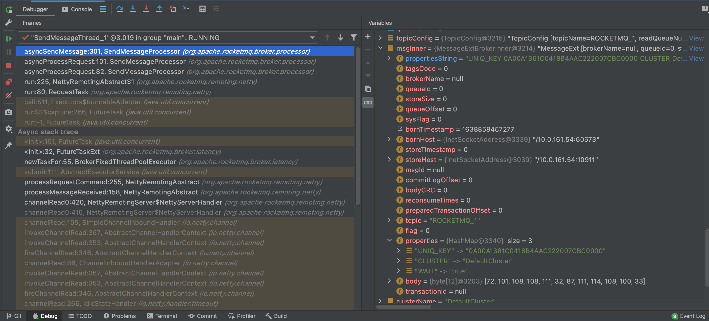

#### 1.NettyRemotingServer#processMessageReceived

```java
public void processMessageReceived(ChannelHandlerContext ctx, RemotingCommand msg) {
  processRequestCommand(ctx, cmd);
}
↓
↓
public void processRequestCommand(final ChannelHandlerContext ctx, final RemotingCommand cmd) {
  final Pair<NettyRequestProcessor, ExecutorService> pair = this.processorTable.get(cmd.getCode());
	
  Runnable run = new Runnable() {
    public void run() {
      //响应回调
      final RemotingResponseCallback callback = new RemotingResponseCallback() {
        public void callback(RemotingCommand response) {
          ctx.writeAndFlush(response);
        }
      };
      
      AsyncNettyRequestProcessor processor = (AsyncNettyRequestProcessor)pair.getObject1();
      processor.asyncProcessRequest(ctx, cmd, callback); //3
    }
  }

  final RequestTask requestTask = new RequestTask(run, ctx.channel(), cmd);
  //提交给线程池处理写入请求
  pair.getObject2().submit(requestTask);
}
```

#### 2.SendMessageProcessor#asyncProcessRequest

```java
public void asyncProcessRequest(
  ChannelHandlerContext ctx,
  RemotingCommand request,
  RemotingResponseCallback responseCallback) {
  asyncProcessRequest(ctx, request)
    .thenAcceptAsync(responseCallback::callback, this.brokerController.getSendMessageExecutor());
}
↓
↓
public CompletableFuture<RemotingCommand> asyncProcessRequest(
  ChannelHandlerContext ctx,
  RemotingCommand request) {
  SendMessageRequestHeader requestHeader = parseRequestHeader(request);
  return this.asyncSendMessage(ctx, request, null, requestHeader);
}
↓
↓
private CompletableFuture<RemotingCommand> asyncSendMessage(ChannelHandlerContext ctx,
                                                            RemotingCommand request,
                                                            SendMessageContext mqtraceContext,
                                                            SendMessageRequestHeader requestHeader) {

	//响应头
  final SendMessageResponseHeader responseHeader = (SendMessageResponseHeader)response.readCustomHeader();
  
  MessageExtBrokerInner msgInner = new MessageExtBrokerInner();
  msgInner.setTopic(requestHeader.getTopic()); 	                          //设置topic
  msgInner.setQueueId(requestHeader.getQueueId());                        //设置队列id
  msgInner.setBody(request.getBody());                                    //设置消息字节数组
  MessageAccessor.setProperties(
    msgInner,
    MessageDecoder.string2messageProperties(requestHeader.getProperties())
  );                                                                      //设置消息属性
  msgInner.setBornTimestamp(requestHeader.getBornTimestamp());            //消息生成时间
  msgInner.setBornHost(ctx.channel().remoteAddress());                    //消息来源地址
  msgInner.setStoreHost(this.getStoreHost());                             //消息存储地址
  
  CompletableFuture<PutMessageResult> putMessageResult = this
    .brokerController
    .getMessageStore()
    .asyncPutMessage(msgInner); //3
  
  //响应头中设置msgId、queueId、consumeQueueOffset后返回响应
  return handlePutMessageResult(
    putMessageResult,
    response,
    request,
    msgInner,
    responseHeader,
    sendMessageContext,
    ctx,
    queueIdInt
  );
}
```




#### 3.DefaultMessageStore#asyncPutMessage

```java
public CompletableFuture<PutMessageResult> asyncPutMessage(MessageExtBrokerInner msg) {
  CompletableFuture<PutMessageResult> putResultFuture = this.commitLog.asyncPutMessage(msg); //4
}
```

#### 4.CommitLog#asyncPutMessage

```java
public CompletableFuture<PutMessageResult> asyncPutMessage(final MessageExtBrokerInner msg) {
  AppendMessageResult result;
  MappedFile mappedFile;
  //低版本这里使用的CAS自旋锁,高并发非常影响机器性能,这里建议改成使用ReentrantLock
  putMessageLock.lock();
  try{
    msg.setStoreTimestamp(beginLockTimestamp);
    
    //创建CommitLog文件
    mappedFile = this.mappedFileQueue.getLastMappedFile(0); //5
    
    //存储消息
    result = mappedFile.appendMessage(msg, this.appendMessageCallback); //6 
  } finally {
    putMessageLock.unlock();
  }
  PutMessageResult putMessageResult = new PutMessageResult(PutMessageStatus.PUT_OK, result);
}
```

#### 5.MappedFileQueue#getLastMappedFile

```java
public MappedFile getLastMappedFile(final long startOffset) {
  return getLastMappedFile(startOffset, true);
}
↓
↓
public MappedFile getLastMappedFile(final long startOffset, boolean needCreate) {
  //"/Users/dlinka/store/commitlog/00000000000000000000"
  String nextFilePath = this.storePath + File.separator + UtilAll.offset2FileName(0);
  //"/Users/dlinka/store/commitlog/00000000001073741824"
  String nextNextFilePath = this.storePath + File.separator + UtilAll.offset2FileName(this.mappedFileSize);

  //这里会创建两个commitlog
  MappedFile mappedFile = this.allocateMappedFileService.putRequestAndReturnMappedFile(
    nextFilePath,
    nextNextFilePath,
    this.mappedFileSize
  ); //5.1和5.2
  this.mappedFiles.add(mappedFile);
  return mappedFile;
}
```

#### 5.1.AllocateMappedFileService#putRequestAndReturnMappedFile

```java
public MappedFile putRequestAndReturnMappedFile(String nextFilePath, String nextNextFilePath, int fileSize) {
  AllocateRequest nextReq = new AllocateRequest(nextFilePath, fileSize);
  this.requestQueue.offer(nextReq);      //将第一个AllocateRequest添加到优先级队列

  AllocateRequest nextNextReq = new AllocateRequest(nextNextFilePath, fileSize);
  this.requestQueue.offer(nextNextReq);  //将第二个AllocateRequest添加到优先级队列

  AllocateRequest result = this.requestTable.get(nextFilePath); //拿出第一个AllocateRequest请求
  result.getCountDownLatch().await(waitTimeOut, TimeUnit.MILLISECONDS); //阻塞等待commitlog的创建
  return result.getMappedFile();
}
```

#### 5.2.AllocateMappedFileService#run

```java
public void run() {
  while (!this.isStopped() && this.mmapOperation()) {
  }
}
↓
↓
private boolean mmapOperation() {
  //从优先级阻塞队列中获取创建请求,优先级顺序根据文件名
  AllocateRequest req = this.requestQueue.take();
  //创建CommitLog
  MappedFile mappedFile = new MappedFile(req.getFilePath(), req.getFileSize());
  req.setMappedFile(mappedFile);
  //创建完成,"门栓"打开
  req.getCountDownLatch().countDown();
  return true;
}
↓
↓
public MappedFile(final String fileName, final int fileSize) throws IOException {
  init(fileName, fileSize);
}
↓
↓
private void init(final String fileName, final int fileSize) throws IOException {
	this.fileName = fileName;
  this.fileSize = fileSize;
  this.file = new File(fileName);
  this.fileFromOffset = Long.parseLong(this.file.getName());
  
  //MMAP
  this.fileChannel = new RandomAccessFile(this.file, "rw").getChannel();
  this.mappedByteBuffer = this.fileChannel.map(MapMode.READ_WRITE, 0, fileSize);
}
```

#### 6.MappedFile#appendMessage

```java
public AppendMessageResult appendMessage(final MessageExtBrokerInner msg, final AppendMessageCallback cb) {
  return appendMessagesInner(msg, cb);
}
↓
↓
public AppendMessageResult appendMessagesInner(final MessageExt messageExt, final AppendMessageCallback cb) {
  int currentPos = this.wrotePosition.get();
  ByteBuffer byteBuffer = this.mappedByteBuffer.slice();
  byteBuffer.position(currentPos); //定位当前写入的位置
  AppendMessageResult result = cb.doAppend(this.getFileFromOffset(),   //文件的偏移,第一个commitlog等于0
                                           byteBuffer,
                                           this.fileSize - currentPos, //剩余的空间
                                           (MessageExtBrokerInner) messageExt); //7
  this.wrotePosition.addAndGet(result.getWroteBytes());
  return result;
}
```


#### 7.DefaultAppendMessageCallback#doAppend

```java
public AppendMessageResult doAppend(final long fileFromOffset,
                                    final ByteBuffer byteBuffer,
                                    final int maxBlank,
                                    final MessageExtBrokerInner msgInner) {
  //commitlog的偏移量
  long wroteOffset = fileFromOffset + byteBuffer.position();
  //msgId生成因子包含Broker地址和commitlog的偏移量
  String msgId = MessageDecoder.createMessageId(
    this.msgIdMemory, msgInner.getStoreHostBytes(ByteBuffer.allocate(8)), wroteOffset);

  //记录consumequeue中的偏移量
  keyBuilder.append(msgInner.getTopic());
  keyBuilder.append('-');
  keyBuilder.append(msgInner.getQueueId());
  String key = keyBuilder.toString();
  Long queueOffset = CommitLog.this.topicQueueTable.get(key);
  if (null == queueOffset) {
    queueOffset = 0L;
    CommitLog.this.topicQueueTable.put(key, queueOffset);
  }

  //计算消息总长度
  /**
   * 	4 //TOTALSIZE
   * 	4 //MAGICCODE
   * 	4 //BODYCRC
   *  4 //QUEUEID(重要)
   *  4 //FLAG
   *  8 //QUEUEOFFSET(重要)
   *  8 //PHYSICALOFFSET
   *  4 //SYSFLAG
   *  8 //BORNTIMESTAMP
   *  8 //BORNHOST
   *  8 //STORETIMESTAMP
   *  8 //STOREHOSTADDRESS
   *  4 //RECONSUMETIMES
   *  8 //Prepared Transaction Offset
   *  4 + bodyLength
   *  1 + topicLength
   *  2 + propertiesLength
   */
  final byte[] propertiesData = msgInner.getPropertiesString().getBytes(MessageDecoder.CHARSET_UTF8);
  final int propertiesLength = propertiesData.length;
  final byte[] topicData = msgInner.getTopic().getBytes(MessageDecoder.CHARSET_UTF8);
  final int topicLength = topicData.length;
  final int bodyLength = msgInner.getBody().length;
  final int msgLen = calMsgLength(msgInner.getSysFlag(), bodyLength, topicLength, propertiesLength);

  //复用msgStoreItemMemory,减少GC
  this.resetByteBuffer(msgStoreItemMemory, msgLen);
  this.msgStoreItemMemory.putInt(msgLen);                                         // 1 TOTALSIZE
  this.msgStoreItemMemory.putInt(CommitLog.MESSAGE_MAGIC_CODE);                   // 2 MAGICCODE
  this.msgStoreItemMemory.putInt(msgInner.getBodyCRC());                          // 3 BODYCRC
  this.msgStoreItemMemory.putInt(msgInner.getQueueId());                          // 4 QUEUEID
  this.msgStoreItemMemory.putInt(msgInner.getFlag());                             // 5 FLAG
  this.msgStoreItemMemory.putLong(queueOffset);                                   // 6 QUEUEOFFSET
  this.msgStoreItemMemory.putLong(fileFromOffset + byteBuffer.position());        // 7 PHYSICALOFFSET
  this.msgStoreItemMemory.putInt(msgInner.getSysFlag());                          // 8 SYSFLAG
  this.msgStoreItemMemory.putLong(msgInner.getBornTimestamp());                   // 9 BORNTIMESTAMP
  this.msgStoreItemMemory.put(msgInner.getBornHostBytes(ByteBuffer.allocate(8))); // 10 BORNHOST
  this.msgStoreItemMemory.putLong(msgInner.getStoreTimestamp());                  // 11 STORETIMESTAMP
  this.msgStoreItemMemory.put(msgInner.getStoreHostBytes(ByteBuffer.allocate(8)));// 12 STOREHOSTADDRESS
  this.msgStoreItemMemory.putInt(msgInner.getReconsumeTimes());                   // 13 RECONSUMETIMES
  this.msgStoreItemMemory.putLong(msgInner.getPreparedTransactionOffset());       // 14 Prepared Transaction Offset
  this.msgStoreItemMemory.putInt(bodyLength);                                     // 15 BODY
  this.msgStoreItemMemory.put(msgInner.getBody());
  this.msgStoreItemMemory.put((byte) topicLength);                                // 16 TOPIC
  this.msgStoreItemMemory.put(topicData);
  this.msgStoreItemMemory.putShort((short) propertiesLength);                     // 17 PROPERTIES
  this.msgStoreItemMemory.put(propertiesData);

  final long beginTimeMills = CommitLog.this.defaultMessageStore.now();
  
  byteBuffer.put(this.msgStoreItemMemory.array(), 0, msgLen);                     //写入MMAP
  
  //返回值中包括消息在commitlog中的偏移量、消息长度、msgId、消息在consumequeue中的偏移量
  AppendMessageResult result = new AppendMessageResult(
    AppendMessageStatus.PUT_OK,
    wroteOffset,                                                    //物理地址
    msgLen,                                                         //消息长度
    msgId,                                                          //消息id
    msgInner.getStoreTimestamp(),
    queueOffset,                                                    //ConsumeQueue中的偏移量
    CommitLog.this.defaultMessageStore.now() - beginTimeMills);


  //consumequeue偏移量+1
  CommitLog.this.topicQueueTable.put(key, ++queueOffset);
  return result;
}
```

---

