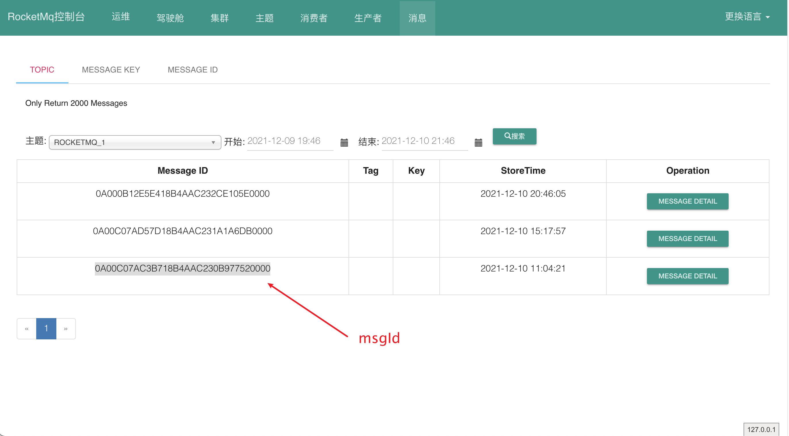
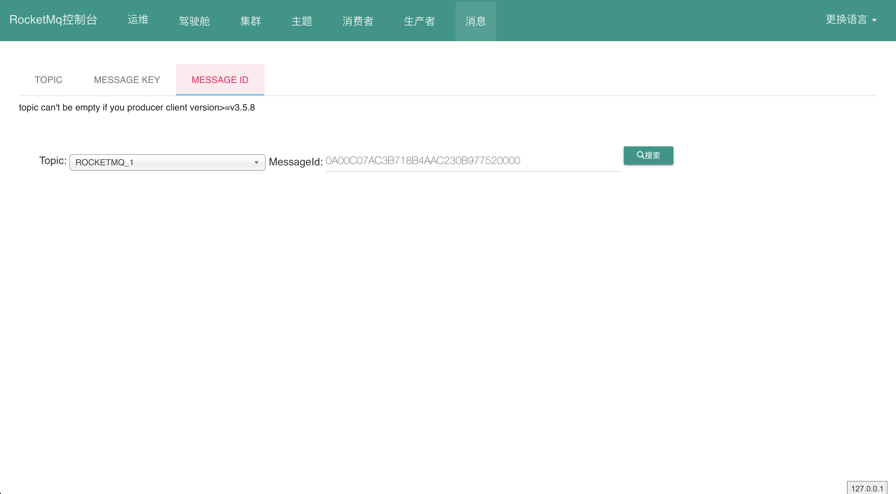

**Producer发送消息成功后的返回值**

```java
SendResult [
sendStatus=SEND_OK,
msgId=0A00C07AC3B718B4AAC230B977520000, //1
offsetMsgId=0A00C07A00002A9F0000000000000000, //2
messageQueue=MessageQueue [topic=ROCKETMQ_1, brokerName=dlinkaCGdeMacBook-Pro.local, queueId=0],
queueOffset=0
]
```

### msgId

```
生成因子包含[IP,PID,HASHCODE,时间差,计数]
```

#### 1.MessageClientIDSetter#setUniqID

```java
public static void setUniqID(final Message msg) {
  msg.putProperty("UNIQ_KEY", createUniqID());
}
↓
↓
public static String createUniqID() {
  StringBuilder sb = new StringBuilder(LEN * 2);
  sb.append(FIX_STRING);
  sb.append(UtilAll.bytes2string(createUniqIDBuffer()));
  return sb.toString();
}
↓
↓
static {
  byte[] ip = UtilAll.getIP(); //"10.0.192.122"=[10, 0, -64, 122]
  LEN = ip.length + 2 + 4 + 4 + 2; //16
  ByteBuffer tempBuffer = ByteBuffer.allocate(ip.length + 2 + 4);
  tempBuffer.put(ip);
  tempBuffer.putShort((short) UtilAll.getPid());
  tempBuffer.putInt(MessageClientIDSetter.class.getClassLoader().hashCode());
  //FIX_STRING包含ip,pid,hashcode
  FIX_STRING = UtilAll.bytes2string(tempBuffer.array());
  setStartTime(System.currentTimeMillis()); //本月1号
  COUNTER = new AtomicInteger(0);
}
↓
↓
private static byte[] createUniqIDBuffer() {
  ByteBuffer buffer = ByteBuffer.allocate(4 + 2);
  buffer.putInt((int) (System.currentTimeMillis() - startTime));
  buffer.putShort((short) COUNTER.getAndIncrement());
  //buffer包含距离本月1号的时间差,计数
  return buffer.array();
}
```

#### 2.MQClientAPIImpl#processSendResponse

```java
private SendResult processSendResponse(
  final String brokerName, final Message msg, final RemotingCommand response
)
  //解析响应结果
  SendMessageResponseHeader responseHeader = 
  (SendMessageResponseHeader) response.decodeCommandCustomHeader(SendMessageResponseHeader.class);

	//msg.getProperty("UNIQ_KEY")
	String uniqMsgId = MessageClientIDSetter.getUniqID(msg);

	SendResult sendResult = new SendResult(sendStatus,
                                         uniqMsgId, //msgId
                                         responseHeader.getMsgId(), //offsetMsgId
                                         messageQueue,
                                         responseHeader.getQueueOffset()); //消息在ConsumeQueue中的偏移量
}
```

### offsetMsgId

```java
表示消息的存储位置，哪个端口，CommitLog的偏移量是多少
生成因子包含[Broker的地址端口,消息在CommitLog中的偏移量]
```

#### 1.DefaultAppendMessageCallback#doAppend

```java
public AppendMessageResult doAppend(final long fileFromOffset,
                                    final ByteBuffer byteBuffer,
                                    final int maxBlank,
                                    final MessageExtBrokerInner msgInner) {
  String msgId = MessageDecoder.createMessageId(
    this.msgIdMemory, //ByteBuffer.allocate(16)
    msgInner.getStoreHostBytes(ByteBuffer.allocate(8)), //2
    fileFromOffset + byteBuffer.position()); //3
}
```

#### 2.MessageExt#getStoreHostBytes

```java
public ByteBuffer getStoreHostBytes(ByteBuffer byteBuffer) {
  return socketAddress2ByteBuffer(this.storeHost, byteBuffer);
}
↓
↓
public static ByteBuffer socketAddress2ByteBuffer(final SocketAddress socketAddress,
                                                  final ByteBuffer byteBuffer) {
  InetSocketAddress inetSocketAddress = (InetSocketAddress) socketAddress; //"/10.0.192.122:10911"
  InetAddress address = inetSocketAddress.getAddress(); //"/10.0.192.122"
	byteBuffer.put(inetSocketAddress.getAddress().getAddress(), 0, 4); //"[10, 0, -64, 122]"
  byteBuffer.putInt(inetSocketAddress.getPort()); //"10911"
  byteBuffer.flip();
  return byteBuffer;
}
```

#### 3.MessageDecoder#createMessageId

```java
public static String createMessageId(final ByteBuffer input, final ByteBuffer addr, final long offset) {
	input.flip();
  input.limit(16);
  input.put(addr);
  input.putLong(offset);
  //包含Broker的地址和端口,消息在CommitLog中的偏移量
  return UtilAll.bytes2string(input.array());          
}
```

---

### 客户端消费消息

```
如果消息消费失败，会将消息重新发送到Broker，msgId不会发送变化，但该消息的offsetMsgId会发送变化，因为其存储在服务器中的位置发生了变化
```

```java
//MessageClientExt#getMsgId
public String getMsgId() {
    //如果存在就使用msgId返回,如果不存在就使用offsetMsgId返回
    String uniqID = MessageClientIDSetter.getUniqID(this);
    if (uniqID == null) {
        return this.getOffsetMsgId();
    } else {
        return uniqID;
    }
}

//MessageExt#toString
public String toString() {
  return "MessageExt [brokerName=" + brokerName + ", queueId=" + queueId + ", storeSize=" + storeSize + ", queueOffset=" + queueOffset + ", sysFlag=" + sysFlag + ", bornTimestamp=" + bornTimestamp + ", bornHost=" + bornHost + ", storeTimestamp=" + storeTimestamp + ", storeHost=" + storeHost
    //打印offsetMsgId
    + ", msgId=" + msgId
    + ", commitLogOffset=" + commitLogOffset + ", bodyCRC=" + bodyCRC + ", reconsumeTimes="+ reconsumeTimes + ", preparedTransactionOffset=" + preparedTransactionOffset + ", toString()=" + super.toString() + "]";
}
```

---

#### 控制台

**这个页面展示的Message ID是上面的msgId**



**这个页面可以通过msgId查询,可以通过offsetMsgId查询**


