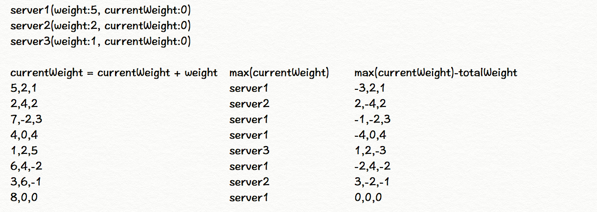

#### 平滑加权轮训算法

```java
public class SmoothWeightRoundRobin {
  static HashMap<String, Pair<Integer, Integer>> SERVERS = new HashMap<>();
  static Integer totalWeight = 0; //总权重

  static {
    SERVERS.put("192.168.1.0", new Pair(5, 5)); //权重5,当前权重5
    SERVERS.put("192.168.1.1", new Pair(2, 2)); //权重2,当前权重2
    SERVERS.put("192.168.1.2", new Pair(3, 3)); //权重3,当前权重3
    totalWeight = SERVERS.values().stream().mapToInt(Pair::getObject1).sum();
  }

  public static String getServer() {
    String maxCurrentWeightKey = null; //当前权重最大值的ip返回值
    for (Map.Entry<String, Pair<Integer, Integer>> entry : SERVERS.entrySet()) {
      if (maxCurrentWeightKey == null) {
        maxCurrentWeightKey = entry.getKey();
      } else {
        if (entry.getValue().getObject2() > SERVERS.get(maxCurrentWeightKey).getObject2()) {
          maxCurrentWeightKey = entry.getKey();
        }
      }
    }

    Integer maxCurrentWeight = SERVERS.get(maxCurrentWeightKey).getObject2(); //最大当前权重
    SERVERS.get(maxCurrentWeightKey).setObject2(maxCurrentWeight - totalWeight); //最大当前权重减去总权重

    for (Map.Entry<String, Pair<Integer, Integer>> entry : SERVERS.entrySet()) {
      Integer weight = entry.getValue().getObject1(); //权重
      Integer currentWeight = entry.getValue().getObject2(); //当前权重
      entry.getValue().setObject2(weight + currentWeight); //当前权重重新设置
    }

    return maxCurrentWeightKey;
  }

  public static void main(String[] args) {
    for (int i = 0; i < 15; ++i) {
      print(getServer());
    }
  }
}
```

