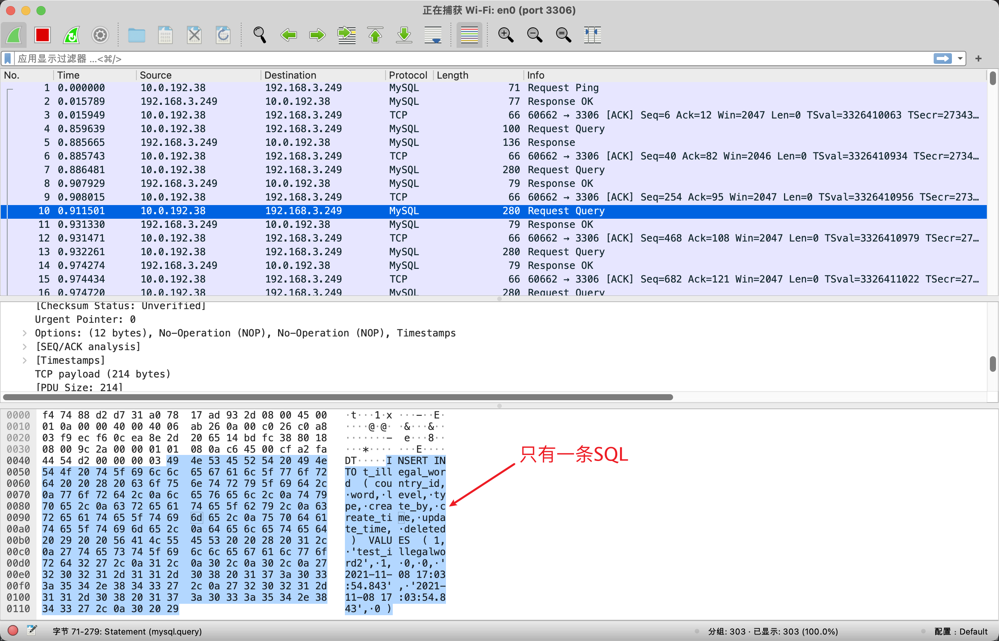

#### useAffectedRows=true

    默认情况下update更新相同值返回的会是匹配的行数,加上这个参数会返回受影响的行,如果更新值是相同的,那么返回就是0,因为数据库没有做更新操作

#### rewriteBatchedStatements

环境

```
Wireshark
  捕获过滤器:Wi-Fi:eth0 (port 3306)
MyBatis-Plus
	执行批量更新方法:saveBatch
```

rewriteBatchedStatements=false



rewriteBatchedStatements=true


