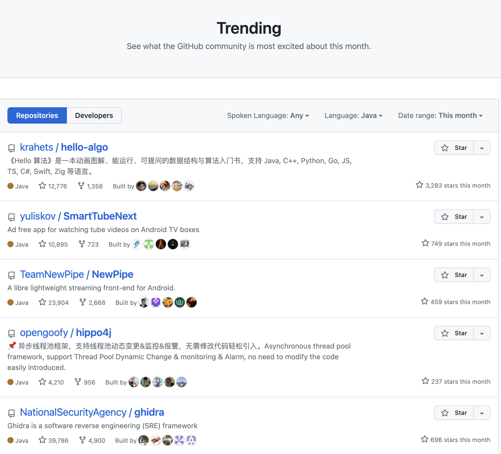
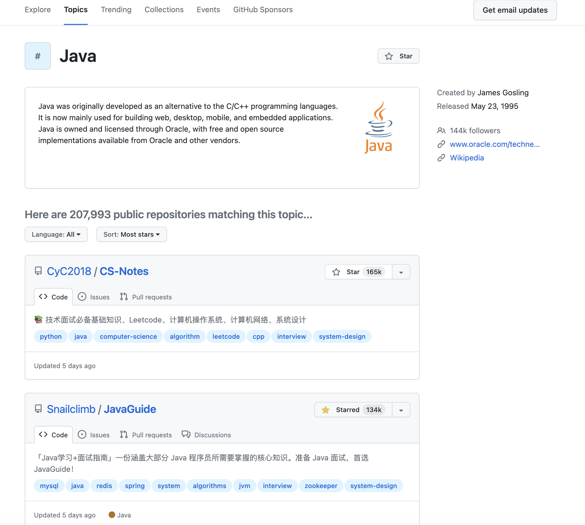

## 一.查看热门趋势

[查看全类](https://github.com/trending)

[查看java类](https://github.com/trending/java)

点击右上角切换，查看每天、每周、每月热点项目

## 二.查看star排行榜

[查看java项目star排行榜](https://github.com/topics/java)

## 三.star增长曲线

[star增长曲线](https://star-history.com/)

